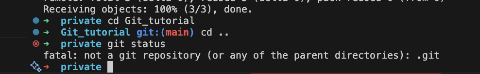
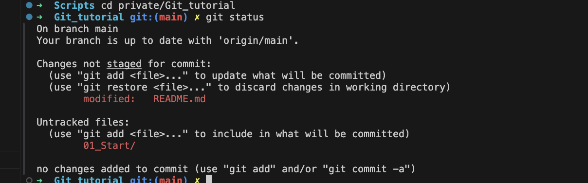
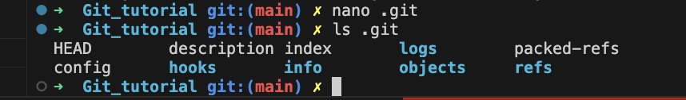

# Start

To start git repo you have to use 

``bash
git init
git status
``

If you are not in repo you will obtain 

This is why `.git` is not present in repository. While invoking `git init` this folder is initialized in the current directory.

This folder includes inflormation about current git repository. **Deleting this file will remove the history of the repository**

***Never create a repository into the repository. This will make the ***