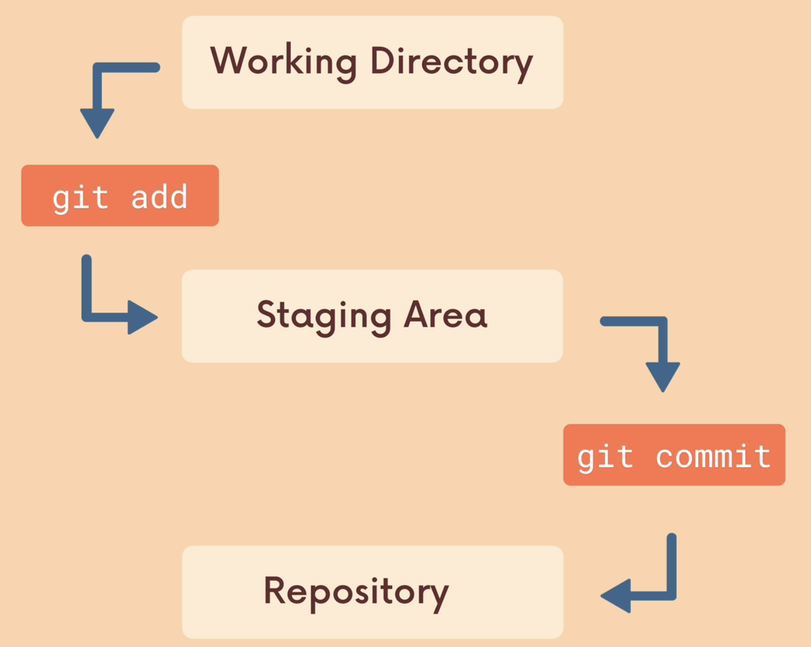
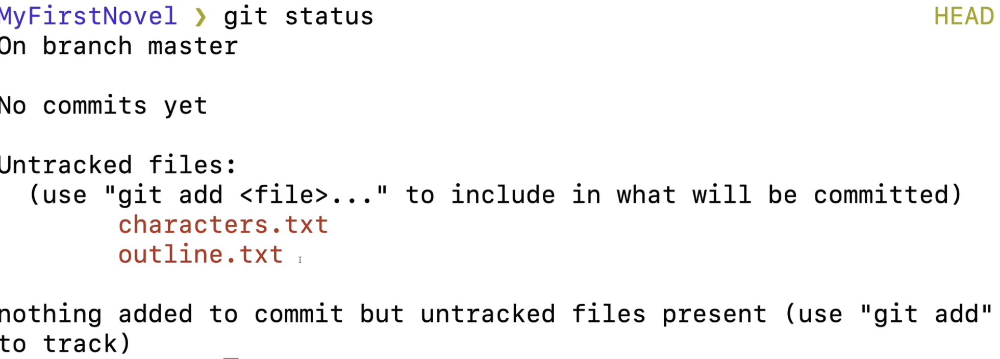
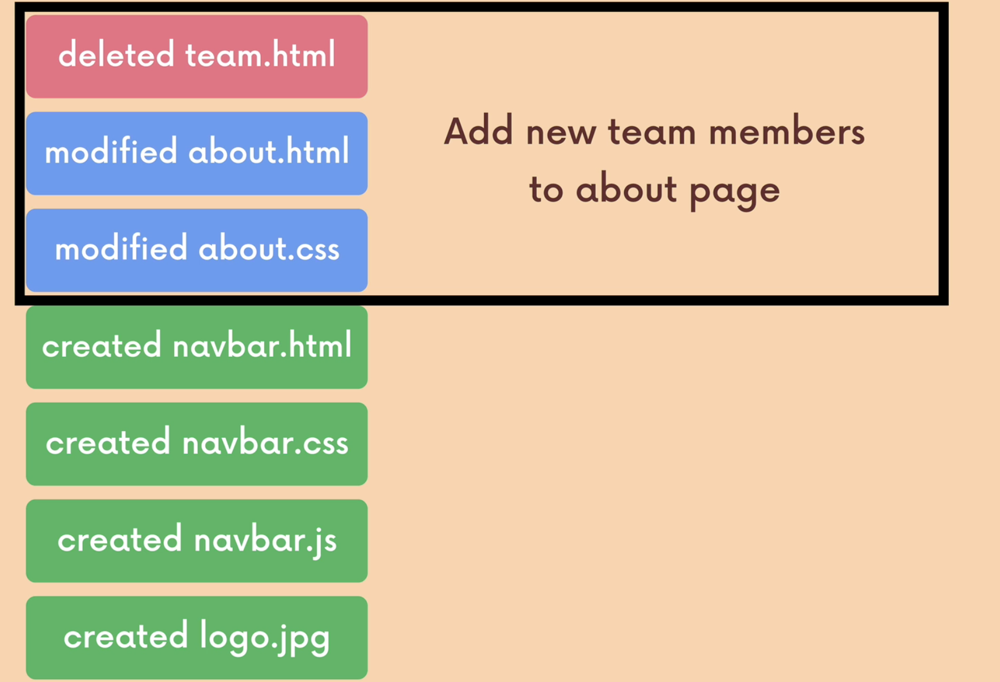

# Workflow

The entire Git workflow includes 3 stages

## **Work on stuff**
Where we are making changes, adding/deleting/changins stuff in local working directory. 

In this stage changes are not tracked yet, so they are only developed locally beyond the changes stage

## **Staging Area** 
Where we are grouping stuff for specific changes. We are switching to this stage using `git add` command.

For example we can group highlighted changes into one adding them 1 by 1. Then in the staging area you can prepare them for commit.

## **Commit**

Commit is not the same as saving something. It is more like doing a checkpoint in the project. You can group the changes and commit them together as the mark in the history. This change should be precisely described to make changes and updates clear

You can commit your changes groups using `git commit -m "Your message"`

This command updates the `.git` file located on top of repository. Best advice is to 
* keep commits as atomic as possible, doing only one thing
* make commit messages in imperative tense: `make this do something` or old school in past tense `made this do something`

Sometimes there can be a situation when you will forget to add something to commit or you want to remove something from the last commit.

Instead of making another commit and mess the commit history the **previous** commit can be "redo" using

``bash
git commit -m "some commit"
git add forgotten_one.txt
git commit --amend
``
Then the folder `.git/COMMIT_EDITMSG` will open. This is because sometimes there is only a need to change the commit message. This will open the VIM in most cases. 

When you do not want to change commit message and add new files just save and leave the file unchanged.

***This one do not works for 10 commits ago***. It moves last commit to staging stage so you can combine them with actual files.

This way you can undo last changes.
Thats easy