# Branching

Every git commit has its own commit that refers to the parent commit
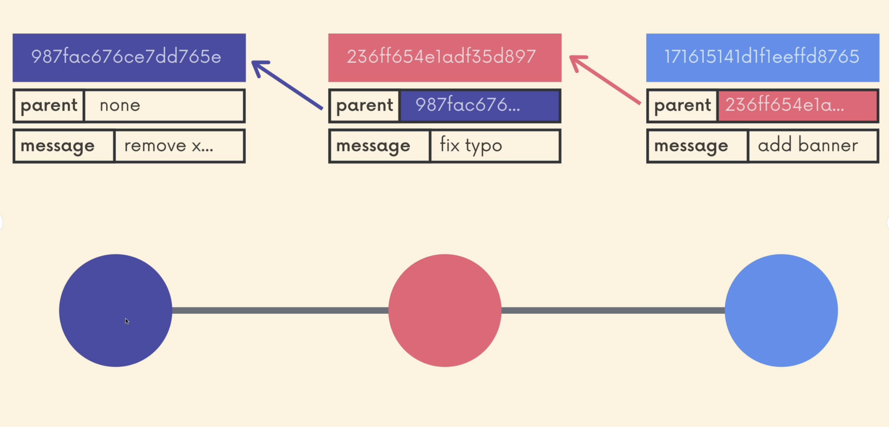

Sometimes there is a need when concurrently we have to:

* make a changes in backend
* fix the bug
* change the layout of the dashboard

With linear approach commit-commit it wouldn't be possible as we would need to close first changes to implement others. Here is where **branching** is coming in.

Branches allows us to create separated contexts where we can independently work on different things. **Changes from one branch do not affect changes on another branch**

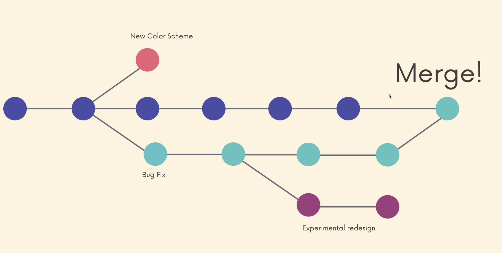

When we are making a commit from one branch and it should not affect another branch, but we can create a "context from context". So in any time from any branch another branch can be created to implement changes from given time in the project. Branches can be treated as a timeline for a project.

## Master branch

From technical perspective **master** branch is like the other branches. It is a starting point for any git project.

In the most of the project **master** is the branch that is taken as the source of truth and official branch of the project.

In 2020 Github renamed default branch from **master** to **main** while official Git name for the branch is still **master**. That may change in the future, but we can do this manually too.

## HEAD


HEAD is like a pointer in the git repository. It shows where we are currently in our project. It always points to particular branch reference.

HEAD points to the latest commit that is made on the master branch, BUT it can be actually changed. HEAD can be associated with concept of bookmarks of the book.

Imagine the situation when we have a book that is read by 3 people:

* Person 1 is on page 2
* Person 2 is on page 23
* Person 3 is on page 76

But in one moment book can be opened only on the one page and this is what HEAD is.

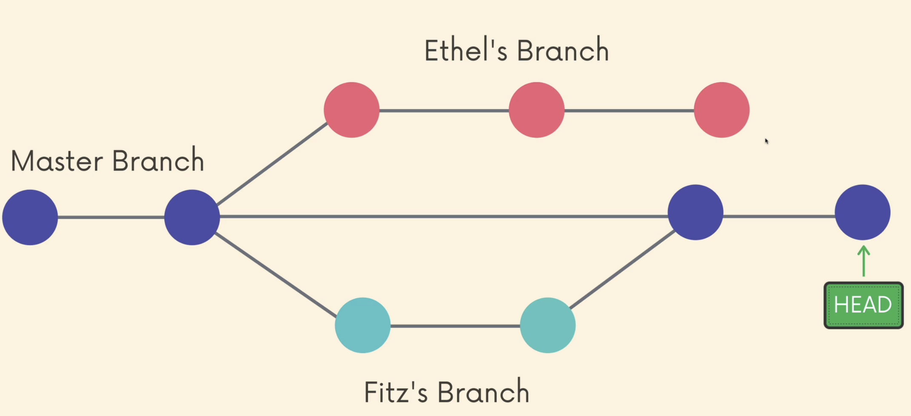

When we are switching branches like the situation when another Person is opening book on other page, the HEAD is moving

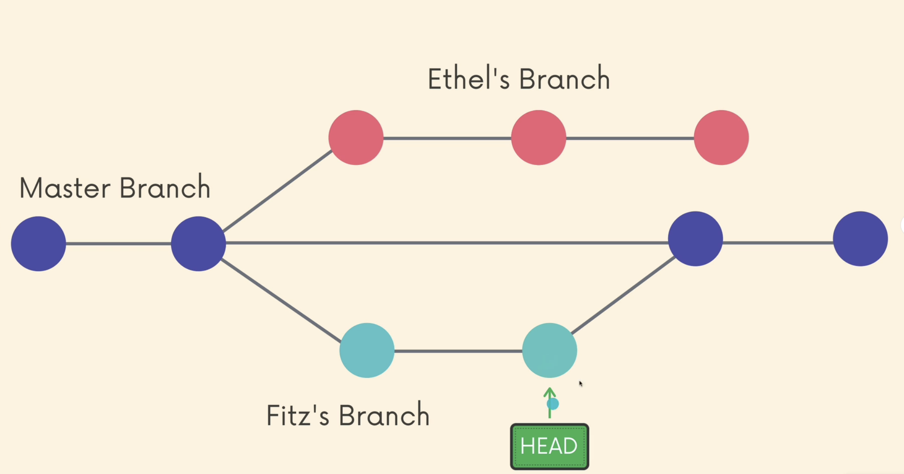

In the console we always can see which commit is actually the currently the HEAD

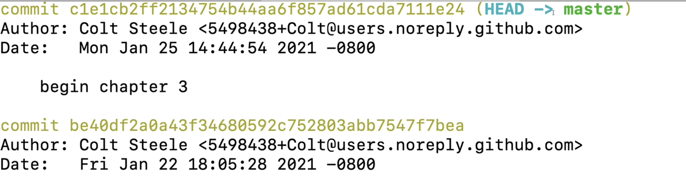

### What is happening in the background?

At the very beginning the starting point from master has been set as a HEAD

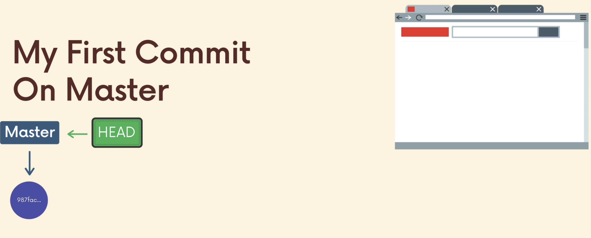

Suppose we made a change on the **master** and made a commit. HEAD is moved

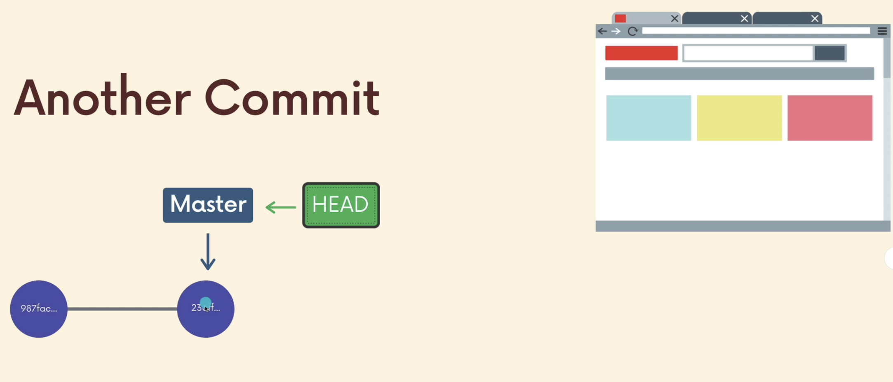

When from this point we are making the new branch, **the HEAD is on the same commit, but the branch is changed. Now we have common point for our branch and master, because HEAD IS ASSOCIATED WITH THE BRANCH!**

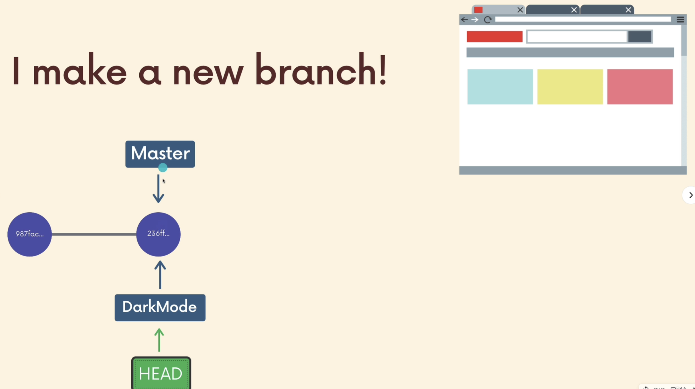

When we are making changes on the new brach HEAD is moved too

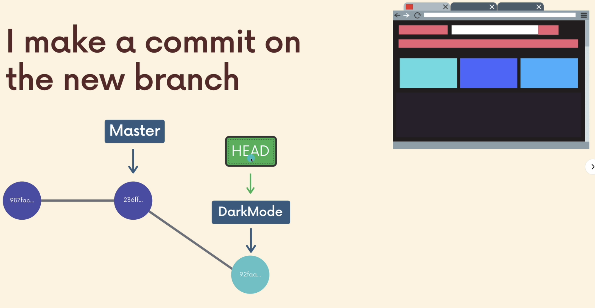
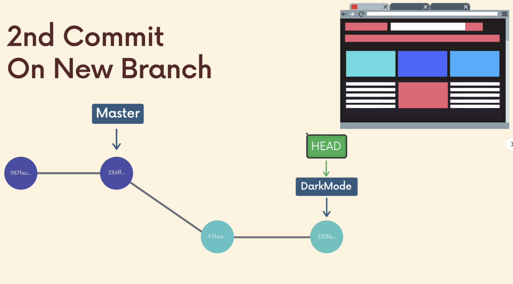

We can always switch to another branch, ex. **master** and the HEAD will be moved to another branch.
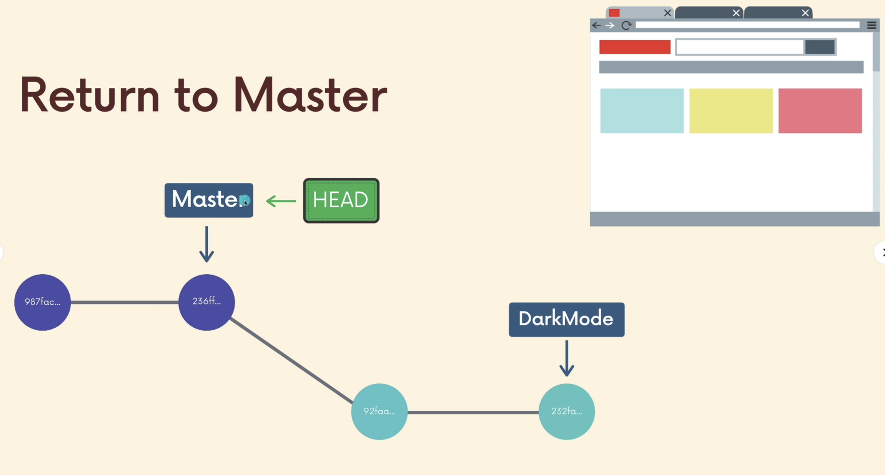

```bash
git branch --> showing branches
git branch <branch-name> --> creating new branch (not moving HEAD)
git switch <branch-name> --> switching to new branch (moving HEAD)
git switch -c <branch-name> --> creating and switching to new branch (moving HEAD)
```

### How git stores HEAD and Branches

If we want to investigate the given commit of HEAD we can find it into `.git/HEAD` file

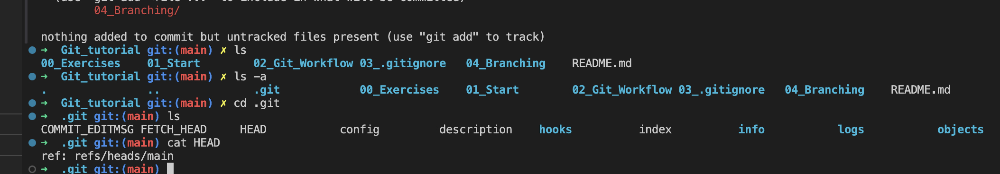

We can see our HEAD are stored in `.git/refs/heads/main`. Moreover folder `.git/refs/heads` stores heads for any other created branch:

New HEAD is created:
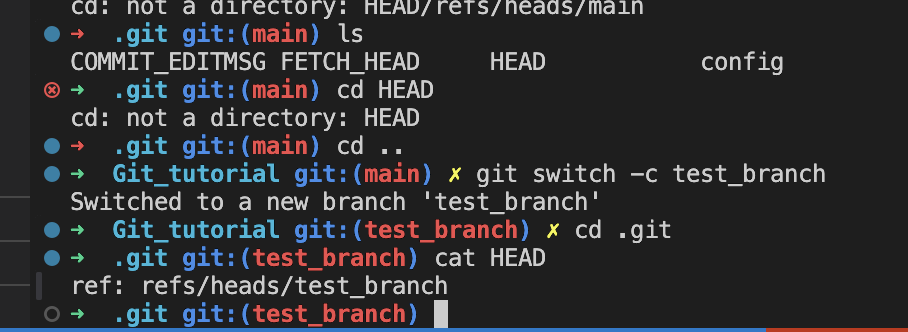

All HEADS are stored in the refs/heads
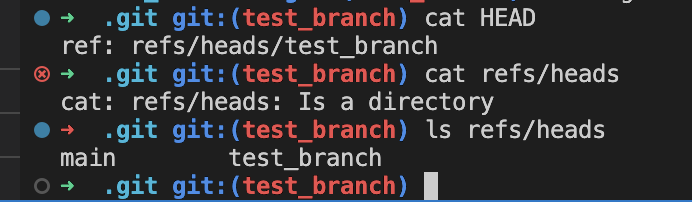

Inside this files there is a hash of particular commit set as a pointer:
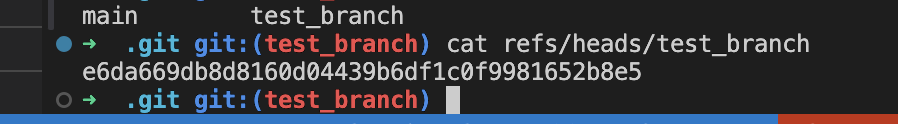

## Checkout vs Switch

It seems like switch and checkout are doing similar thing, but `git checkout` is doing additional things under the hood, while `git switch` is much simpler.

The difference is that **checkout** can be used to manage the tree files:

[git-checkout](https://git-scm.com/docs/git-checkout)

## Switching branches with unstaged changes

When trying to switch between branches with unstaged changes you probably will face an error:

```bash
error: Your local changes to the following files would be overwritten by checkout:
    <file>
Please commit your changes or stash them before you switch branches.
Aborting
```

To omit that and move the changes to another branch the good way is to stash them using `git stash`

```bash
git stash
git switch -c <branch-name>
git stash pop
```

It will:

* "pack" changes
* create new branch
* switch to it
* "unpack" changes

!!! ***THERE IS AN EXCEPTION THAT ALLOW US TO MOVE CHANGES WITHOUT STASHING***

When we are creating a new file that didn't previously existed in different branch git do not recognize any conflicts between branches --> as this file exists only in the unstaged stage. It will come with us during switch.

## Deleting and renaming branches

### Delete

`git branch -d <branch-name>`

The problem with this is that we sometimes can face a problem:

```bash
error: The branch <branch-name> is not fully merged.
If you are sure you want to delete it, run 'git branch -D <branch-name>'
```

This happens before you fully merge your branch and it will be free of changes that are not propagated. If you would like to force it anyway, you should use

`git branch -D <branch-name>`

### Rename

`git branch -m <new-branch-name>`

You have to be on the branch you want to rename!
