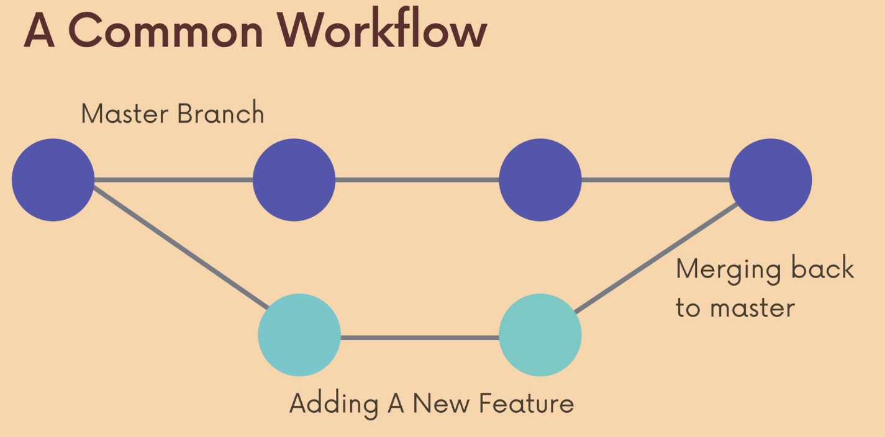
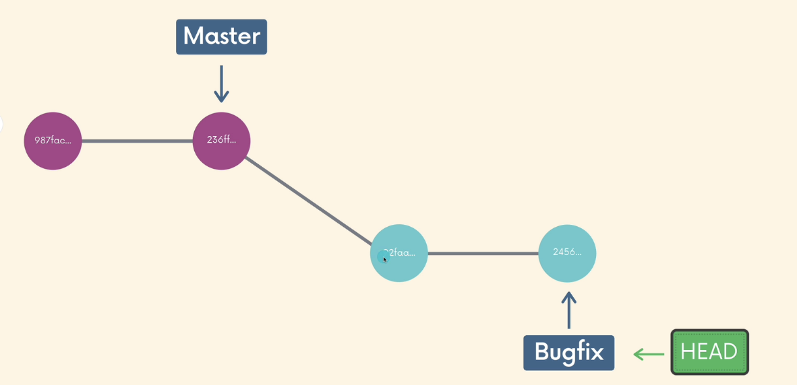
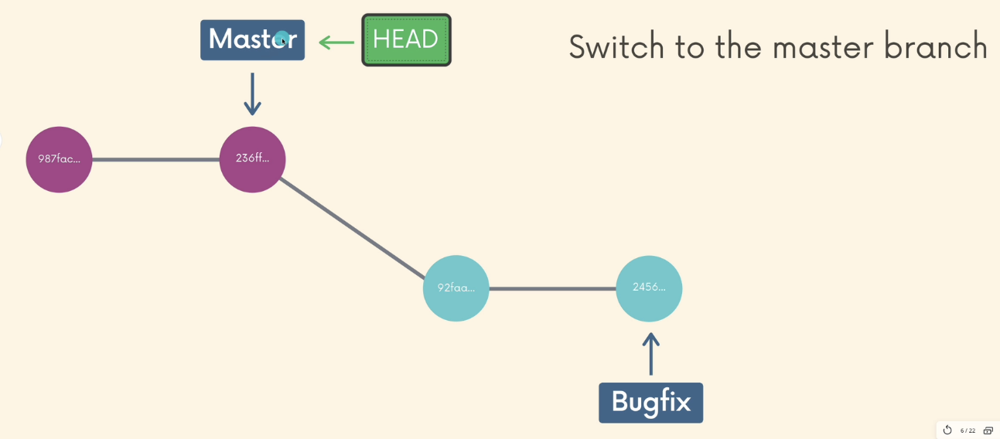
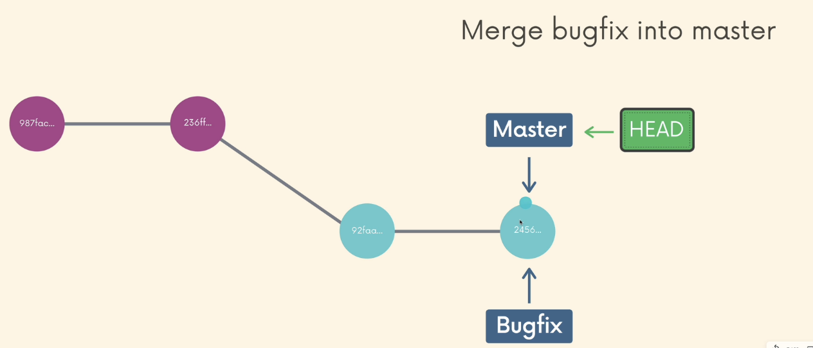
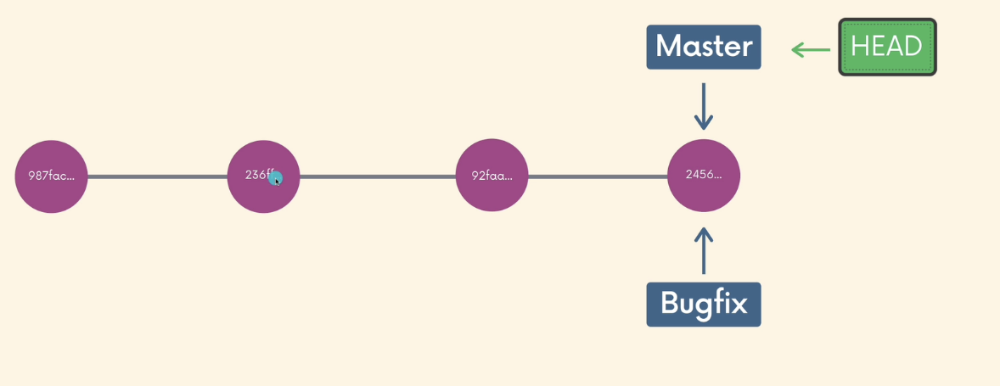
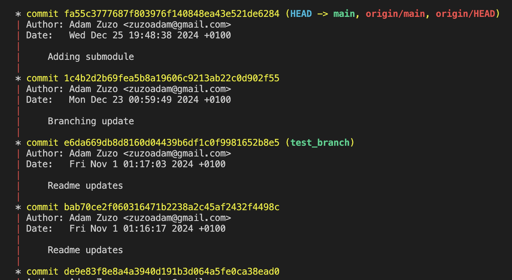
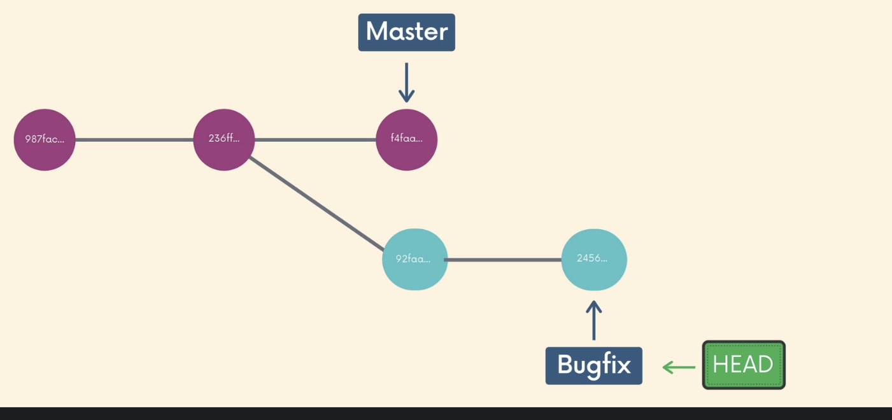
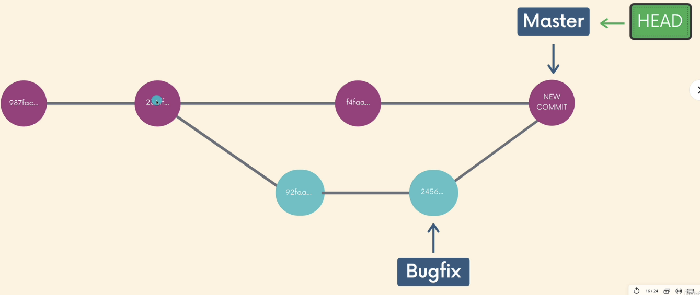
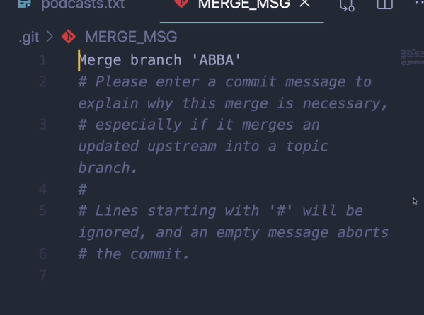
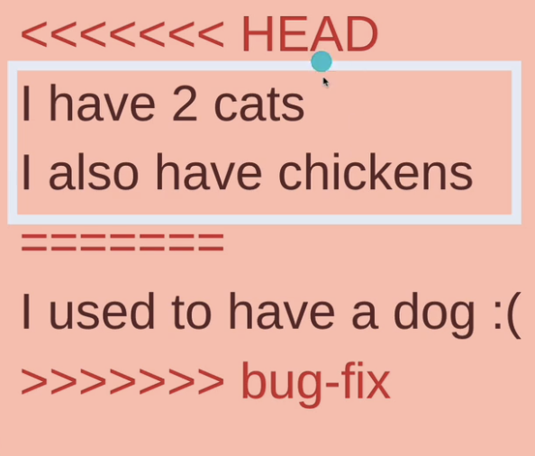

# Merging

Merging is like applying changes in the existing project. For a one branch this is pretty simple, but often we are working in the environment, where many branches are visible

There are two merging concepts that shouldn't be broken:

* **WE MERGE BRANCHES, NOT COMMITS**

    We cannot pick a commit from a branch and applied it to another commit on another branch. We are applying changes on the entire branch changes before with their history. We do not want to omit dependencies for example (avoiding cherry pick)

* **WE ALWAYS MERGE TO THE CURRENT BRANCH HEAD**

    We merge exactly to head

Image a situation when we are developing a changes that is needed do fix the bug on `bugfix` branch

The first thing we should do, we have to switch to the `master` (this is our baseline that other changes will be applied to)

`git switch master`

HEAD is now changed

Next step is to applied changes and merge the branch `bugfix` to `master`

`git merge bugfix`

Now the changes are applied:

This merge is known as **FAST FORWARD MERGE**

## Visual merge

Merges can be visualized using command `git log --graph` or using Git Graph extension

## Other merges

A popular situation is where working on another branch, our `master` has changes applied.

In this case simple fast forward cannot be applied as  our feature branch is not a continuity of the master.

What git is doing under the hood is the NEW COMMIT that will take the applied changes from feature branch and sync them with master changes.

When we apply `git merge bugfix` now in the CLI, the `MERGE-MSG` will pop up.

We can now close this if we do not want to rename default message and the merge will be done automatically with the new commit.

This situation is common, BUT simple if we do not work on the same file between two different branches. In this case we will receive **conflicts** to resolve

## Conflicts

Conflicts are common while working with the Git. It happens when git do not know which changes should be applied as a baseline for the given merge.

When the conflict is detected the changes are noticed into the conflicted file.

There are a concept of conflict markers
The content from current HEAD

* <<< HEAD === -> the branch you are trying to merge content into
* === >>> -> the content from the branch you are trying to merge from

To resolve conflicts changes have to be done manually after opening the conflicted files. We can keep changes from one or both branches. Markers have to be deleted and changes should be committed.
