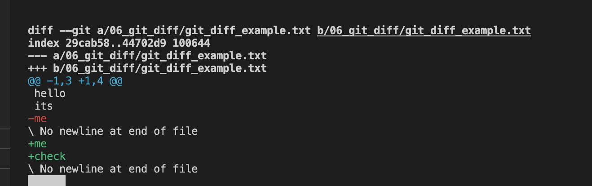
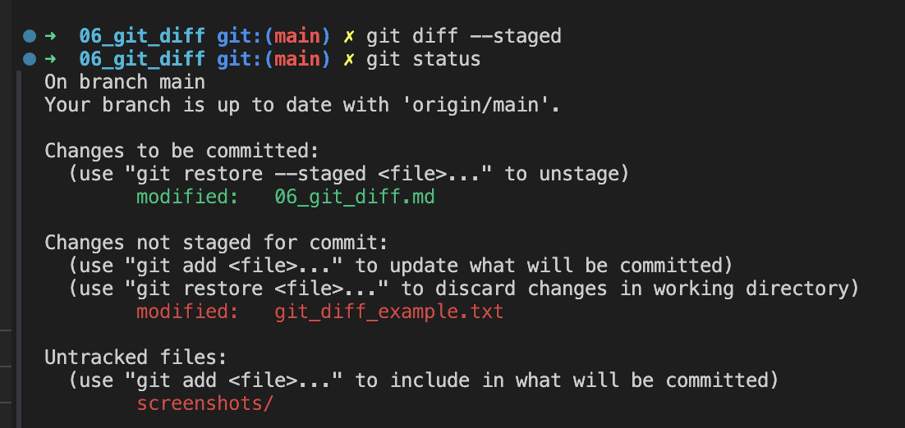
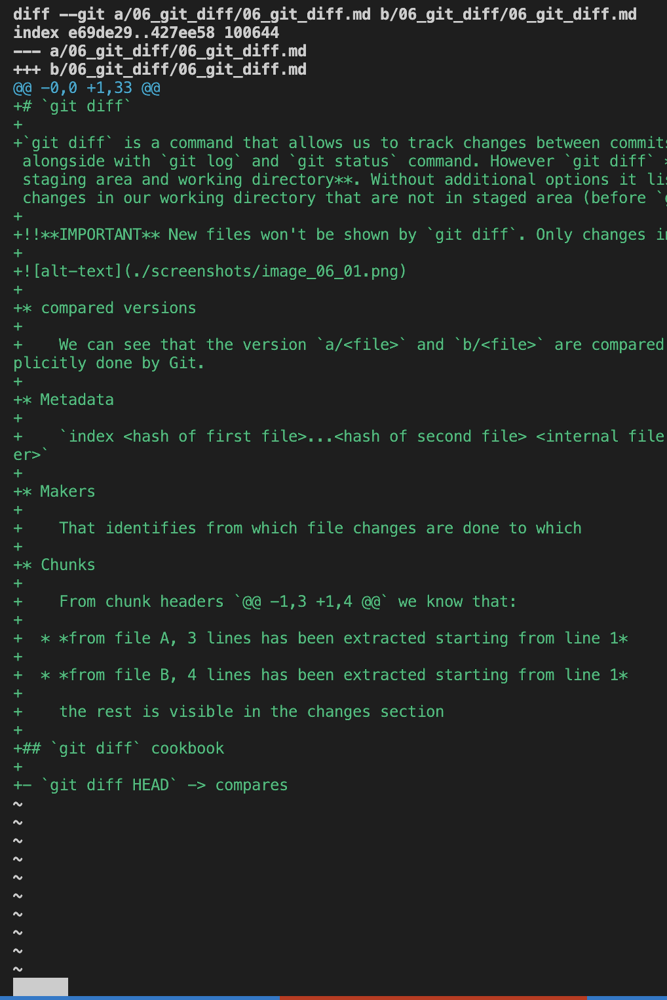
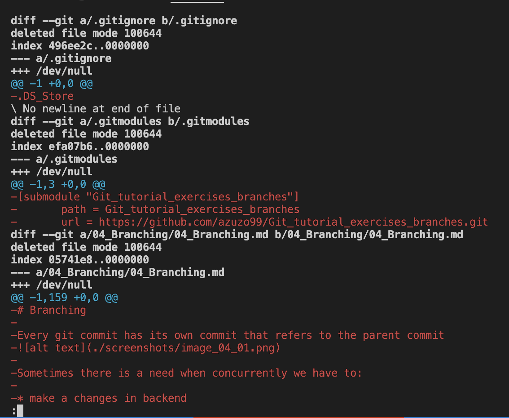

# `git diff`

`git diff` is a command that allows us to track changes between commits and branches alongside with `git log` and `git status` command. However `git diff` **is comparing staging area and working directory**. Without additional options it lists all of the changes in our working directory that are not in staged area (before `git add`).

!!**IMPORTANT** New files won't be shown by `git diff`. Only changes inside them.

* compared versions

    We can see that the version `a/<file>` and `b/<file>` are compared. Paths are explicitly done by Git.

* Metadata

    `index <hash of first file>...<hash of second file> <internal file mode identifier>`

* Makers

    That identifies from which file changes are done to which

* Chunks

    From chunk headers `@@ -1,3 +1,4 @@` we know that:

  * *from file A, 3 lines has been extracted starting from line 1*

  * *from file B, 4 lines has been extracted starting from line 1*

    the rest is visible in the changes section

## `git diff` cookbook

* `git diff HEAD` -> compares everything in the working tree since last commit

* `git diff --staged` -> compares diffs between staging area and last commit

* `git diff --cached` -> compares diffs between staging and last commit (similar to --staged)

* `git diff <branch_a> <branch_b>` -> compares branches

You can check specific file adding its name to command, example:
`git diff HEAD [filename]`

* `git diff <commit_a> <commit_b>` -> compares commits

    `git diff 1c7c2ffcaa40878593f2e89dd984575cad6ba5f1 074edab67490ac8ca5f9e8014176087ca98c1ad9`
