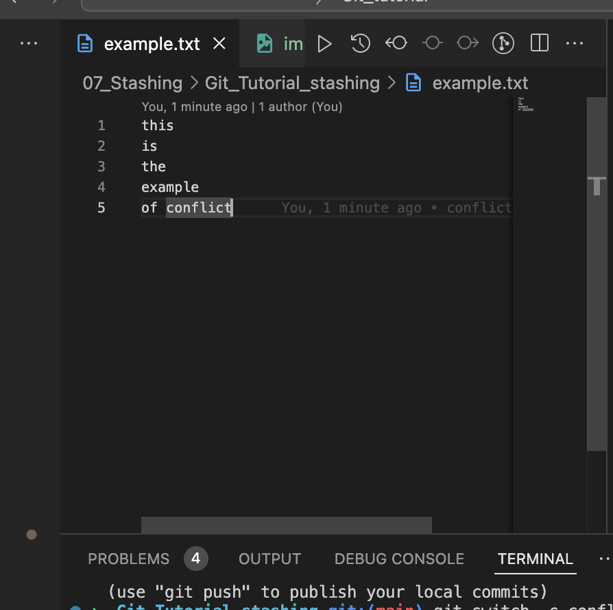
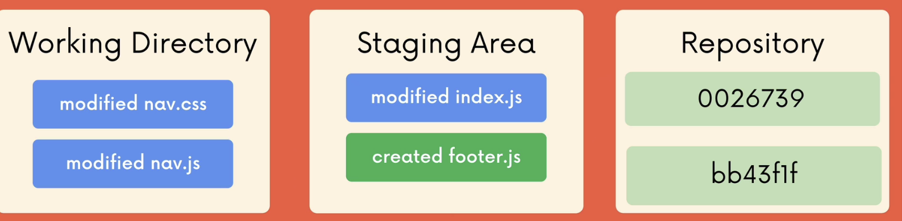

# Stashing

Imagine a situation when we are working on the `puppy` branch that came from the `master`.
I've made some changes on the `puppy` branch and need to switch back to the `master`.

Imagine we have file that is updated between the branches.

There are 2 options:

## Option 1

All my changes will come with me to the destination

**Why?**
If I've made a changes on the file and switched to between branches without touching it on one of the branch the changes will come with me to another branch if not staged:

We can see above that the changes came to the `main` from `example_branch` if they were in working tree

What happen if we commit the changes?

If we commit the changes and switch the branches the changes will come **only with the branch. When switching to `main` the changes will be preserved only on the branch where the commit was made**

## Option 2

Git will block me and I won't be able to switch

**Why?**

Imagine we have done changes in the line 5 of the file and commit them.

Now the `main` branch is one commit after the `conflict_branch`. When we are applying changes on the same file and try to switch between branches Git see the conflict on the file that we are trying to change and it will be blocked.

To preserve these changes in the branch, but keeping the way to switch between the branches we can use `git stash` to 'save' the changes and `git stash pop` to 'load' them on the different branch.

This happens for example when you are working on the bigger project on `project` where the `master` is a base. During work the one of the processes failed. You need to fix that, but you are not ready to commit your work and switch to `bugfix` branch. You do not want to take them with you too.

You can use `git stash` or `git stash save` to pack them into the stash

Now it is easy to switch between the branches. After `git stash pop` changes are unpacked

## Stash Apply

Sometimes there is a need to populate changes without removing them from the stash. This can be done using `git stash apply`

!!**BE CAREFUL. This command can make a conflict, but they need to be resolved manually**

## Multiple Stashing

We can save multiple versions of changes using multiple `git stash` commands and list them using `git stash list`, then apply them using `git stash apply stash@{<number>}` or drop `git stash drop stash@{<number>}`. All of the stashes can be dropped using `git stash clear`
