# Udnoing changes

## `git checkout`

From the very first point of view `git checkout` is similar to `git switch`, BUT **this is not true**.

`git checkout` is overloaded that means it combines `git switch` and `git restore`.

We can use this command to:

* create branches
* switch to new branches
* restore files
* undo history

This is why recommendation is to not use checkout too much and use less complex functions.

When you will use `git checkoout commit <hash>` you will come to the previous commit, BUT you will see this:

```git
You are in 'detached HEAD' state. You can look around, make experimental changes and commit them, and you can discard any commits you make in this state without impacting any branches by switching back to a branch
```

***What does it mean?***

If we are switching between the branches we can see that HEAD is always at the latest commit that we applied. So last commit is a pointer as the branch reference for HEAD. Here is where **detached HEAD** comes in.

### Detached HEAD

Detached HEAD points to particular **COMMIT** not a **BRANCH**. Why is this useful?

* we can see the commit content - HEAD is still detached, we just investigate
* we can leave everything and go back to desired branch - reattach the HEAD to the entire branch last commit
* we can create new branch and switch to it from particular commit - HEAD is reattached

We can investigate not by specific commit, but certain amount of commits using `git checkout HEAD~<no-back-commits>`


### Undoing changes using checkout

If we have a file that is changed and we wanted to discard changes and go back to the last made commit on this file we should use `git checkout HEAD <filename>` or `git checkout -- <filename>`. It will bring us back to the last commit made on the file.

## `git restore`

`git restore` is the new command that is recommended instead of `git checkout`, that was too complex. Command
`git restore <filename>` will bring file to the last commit like `git checkout HEAD <filename>`. If we want to go to the particular commit we should use `git restore --source HEAD~<no-back-commits> <filename>` or `git restore --source <commit-hash> <filename>`. **This command is able to be undo**

We can also unstage files from staged area, as the opposite to `git add` using `git restore --staged <filename>`

## `git reset`

`git reset <commit-hash>` is much more powerful as it will reset entire commit. If we will do that, all commits will be removed, BUT the changes are preserved in the files

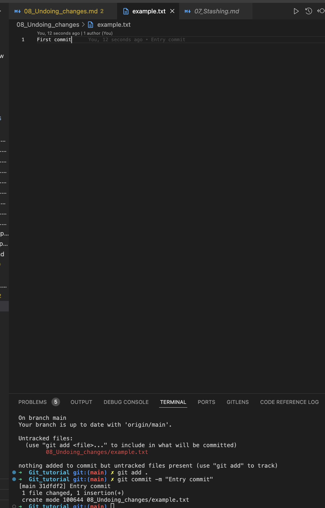

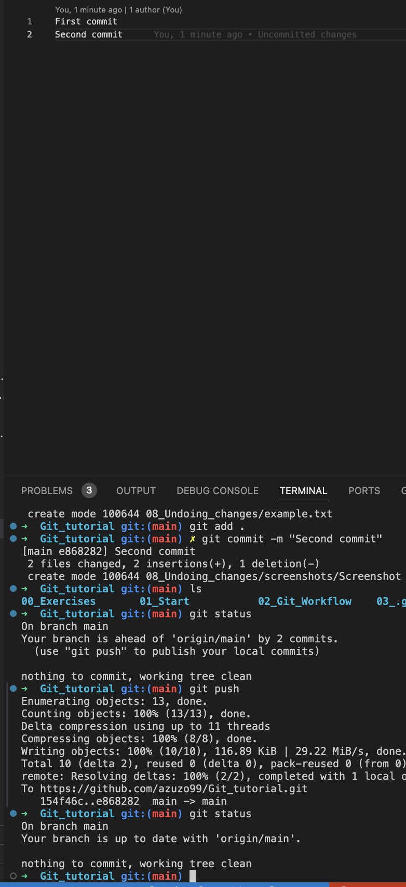

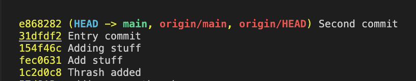

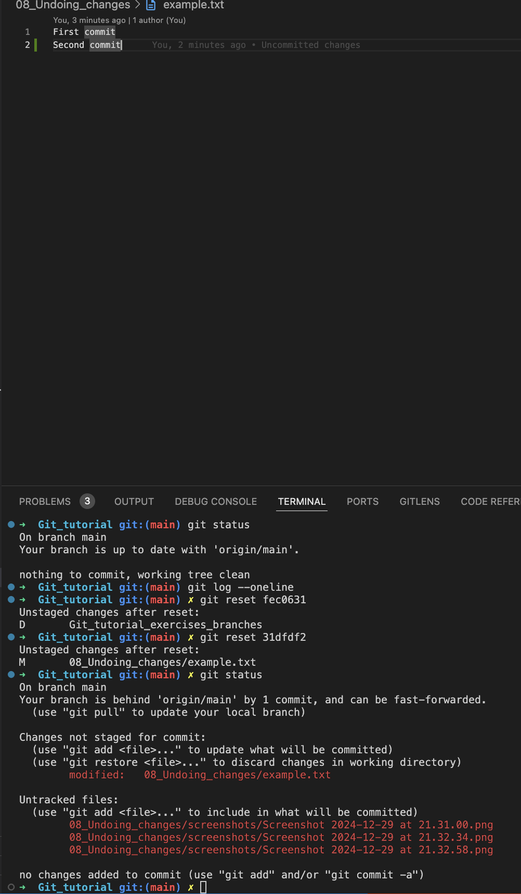

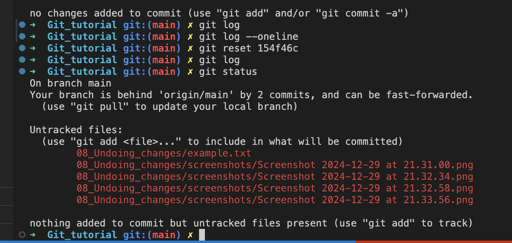

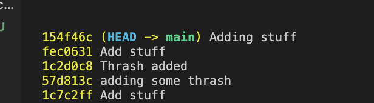

Under the hood:

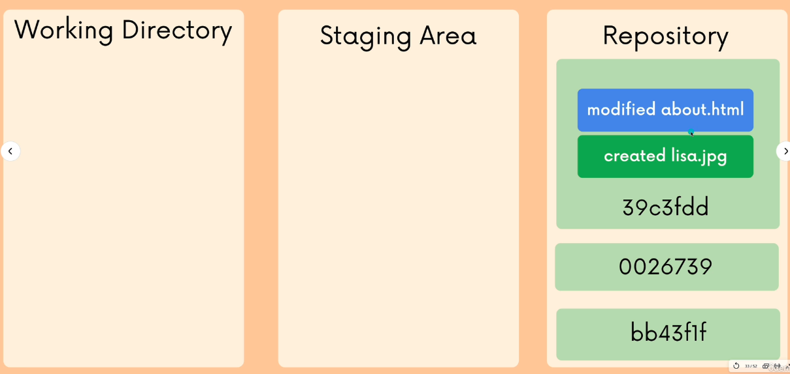

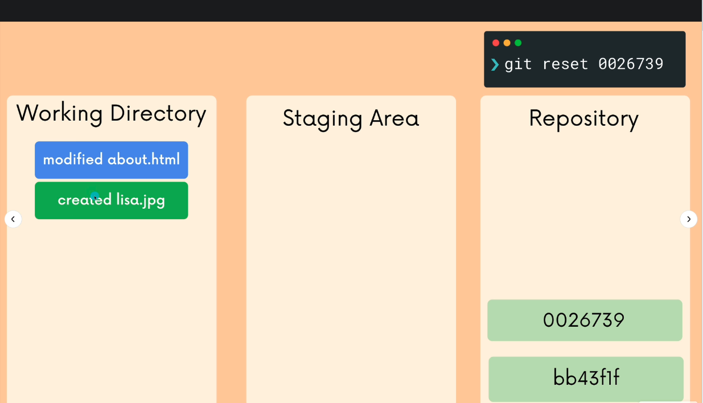

If we do `git reset --hard <commit-hash>` this will delete entire commit and the changes

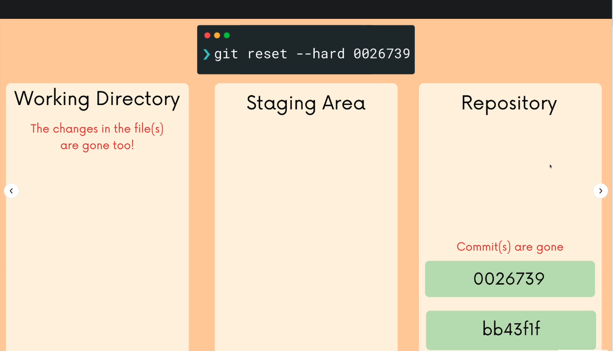

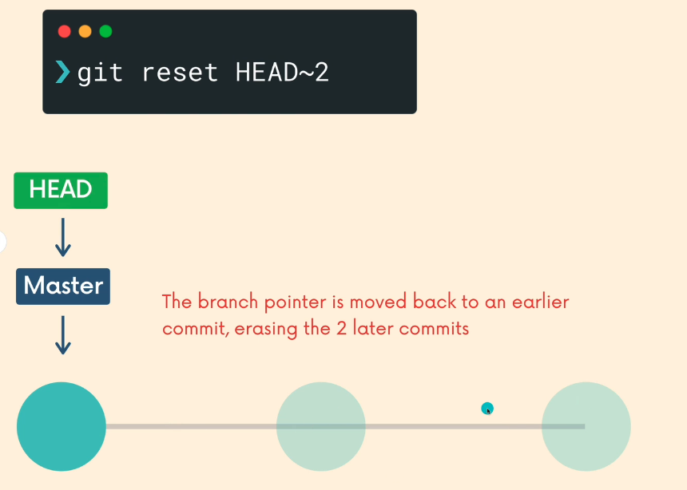

## `git revert`

Revert is undoing changes from the commit, BUT it is no the same as `git reset`. `git revert <commit-hash>` is creating a new commit which reverses changes from a commit. This is why we need to parse commit message when this is invoked.


*Why?*

This is when we want to make a marker when the changes were removed. Reset does not support that, this is why working with collaboration project we would like to have this changes marked as we can mess up the history of changes.

`git reset`

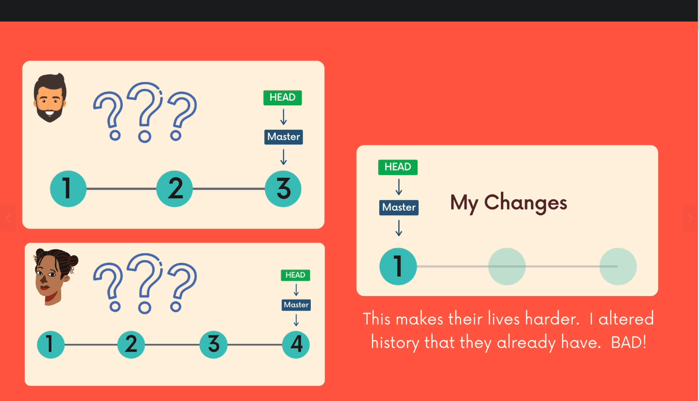

`git revert`


