# Github

**Git and Github are not the same**. Git is a software that can run without Github. It handles commits, repos and all the changes in the project on the local machine, while Github is a hosting platform for these ones. Github is running with Git under the hood and extends basic capabilities of Git to allow us to collaborate and keep changes in the centralized places

## SSH Config

To collaborate in a projects localized in Github we need to setup the pair of SSH keys while logging into Github

## Understanding Git and Github Flow

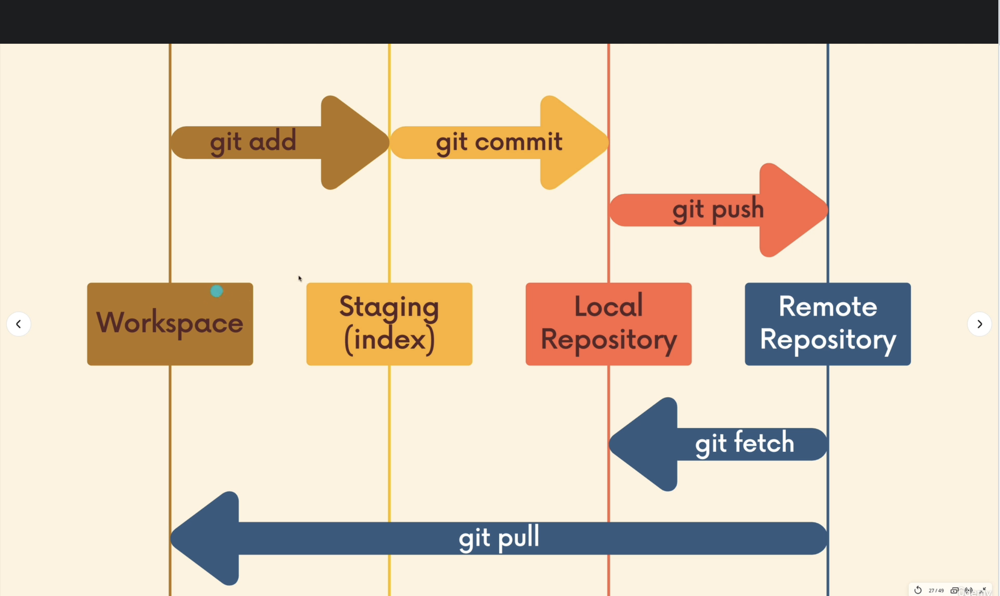

## `git clone`

`git clone <url>` is the basic command that allows us to clone the repository from the Github into our local directory. It setup the repository, initialize it and give us access to history. *WARNING: do not clone repositories into existing repo*

Anyone can copy repository from Github, **but not everyone can push to it**. We do not need permission the fetch given project, but we need permission to contribute to it. This is because `git clone` is not limited to Github. We can for example clone repo from Gitlab.

## `git remote`

Git remote is like our destination from/to which we are pulling or pushing. We need to setup remote at first to correctly operate on given resources.

We can invoke `git remote` or `git remote -v` to see currently setup remotes

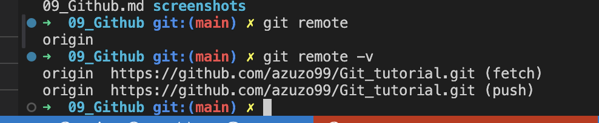

When this is set tup, while we are invoking `git pull` or `git push` we exactly ask about "Hey Git, have any changes been done under that origin URL?".

But we can setup our own remote using `git remote add <name> <repo-url>`

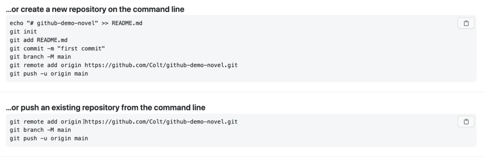

When setting up the new repository on Github we have to add origin. This pins our local repository with corresponding remote repository on the Github.

We can change names of remotes or detele them `git remote remove <old> <new>` or `git remote remove <name>`

## `git push`

`git push <remote> <branch>` is allowing us to push all changes into given remote and branch for this specific destination.

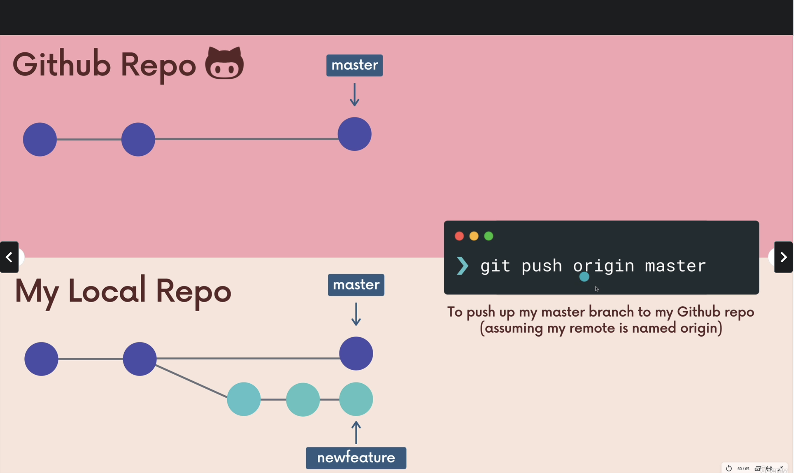

While we are doing this our local changes has been applied with history to a given branch in Github.

BUT we can push changes to different branches using `git push <remote> <local-branch>:<remote-branch>`. In the scenario above local and remote branch is the same.

## `git push -u <remote> <branch>`

Flag `-u` relates to upstream of the local branch.

*What does it mean?*

We can set a link between current local branch and remote branch. They are usually named the same, so it means that for example our local `master` reflects the remote `master`. From now I do not need to specify branches while pushing. Git and Github know that when I am invoking `git push` on currently used local `master`, all of the changes will be pushed to remote `master`.

*Remember*: In this example branches are named the same, but we always can set upstream for different branches `git push -u <remote> <local-branch>:<remote-branch>`. From now when `git push` is invoked it uses the upstream defined by this command.

## Remote tracking branches

Git tracking branches between local and remote environment. On the Github we see only the `master` branch, but on local computer beside the `master` branch we need to have some pointer to Github repository.

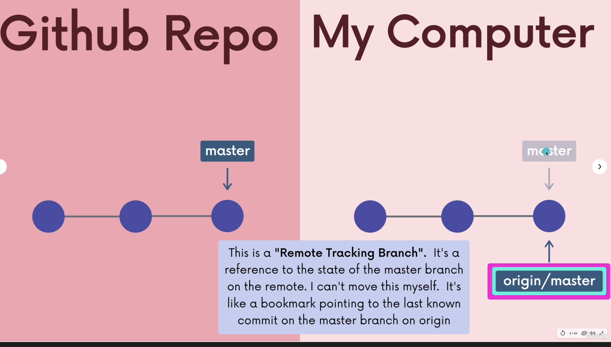

This connection is here described by `origin/master`. So this is the pointer to the last known commit by Github. In this case to the repository `origin` and the branch `master`.

We can use `git branch -r` to see how the tracking is provided

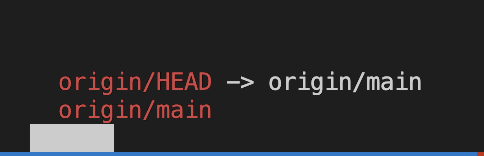

We can see the remote branch for now is `origin/main` and HEAD is tracked.

**What if local branch and remote is diverged then?**

Remote repository do not move as we are doing changes locally, so in one point they will diverge

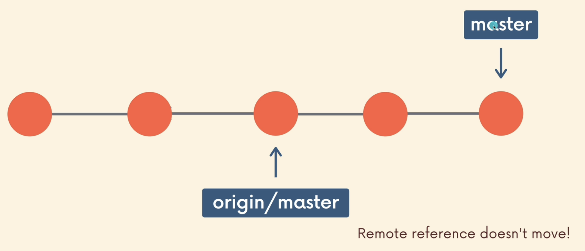

When you will make a changes locally and will use `git status` to check what is going on, you can find:

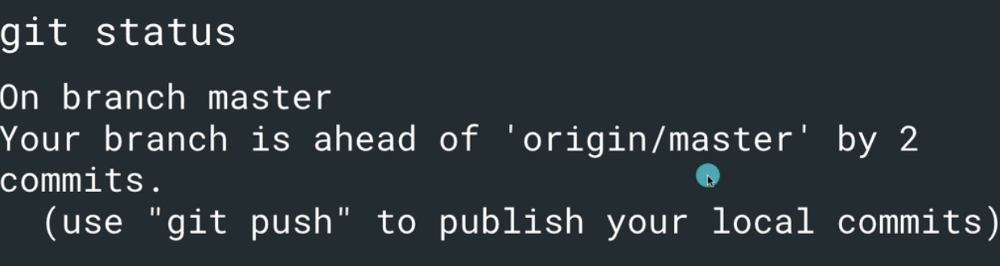

We can always investigate how `origin/main` looks like using `git checkout origin/main`

LOCAL:

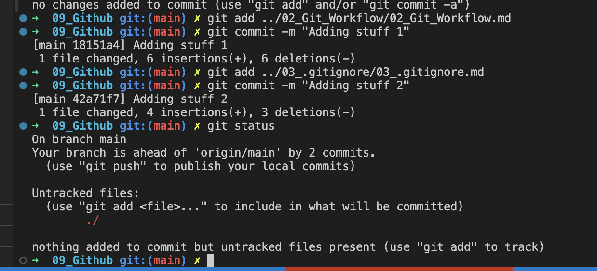

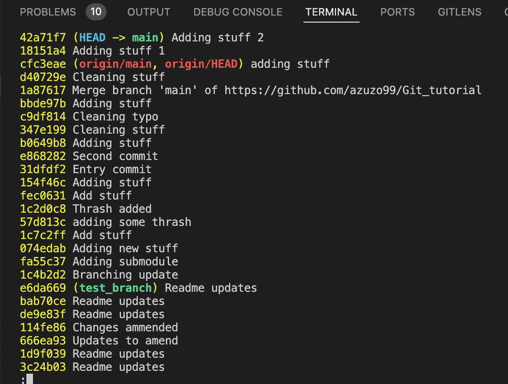

REMOTE:

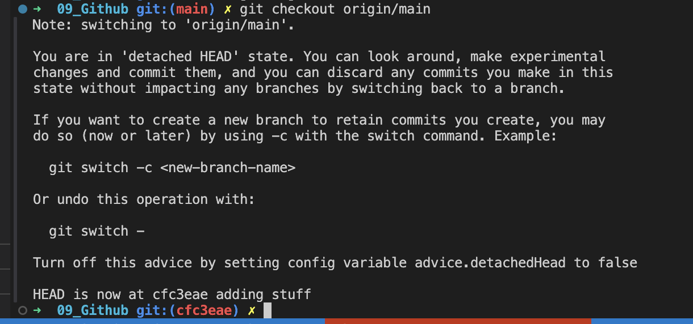

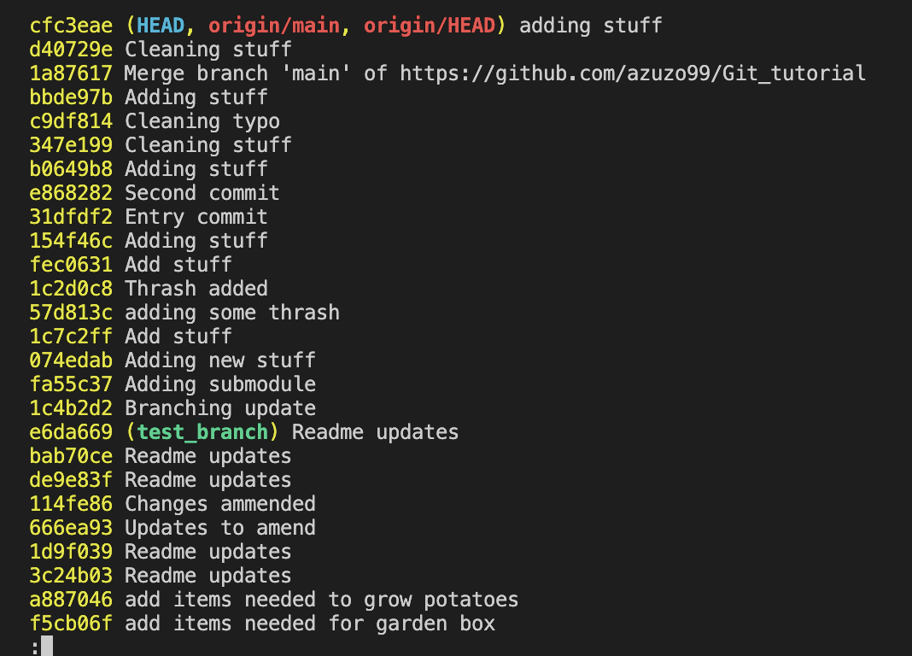

The `origin/master` HEAD will be set to the latest local commit after the `git push`

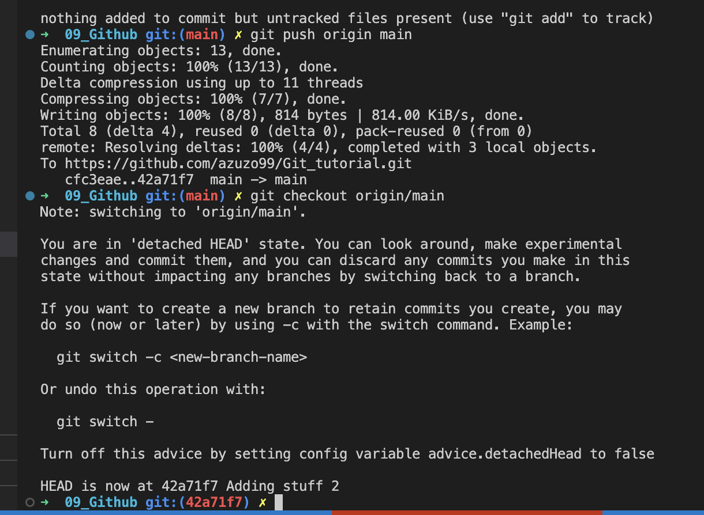

## Remote branches

In the normal condition when we are using `git switch` our workspace branch is pinned to corresponding remote destination. Without it we would need to always do `git checkout <remote>/<branch>`, detach HEAD and start to work from now. Fortunately `git switch` is doing everything under the hood. The previous way to handle that was `git checkout -b <branch> --track <remote>/<branch>`. This command created and pinned our local repo and branch to corresponding remote repo and branch.

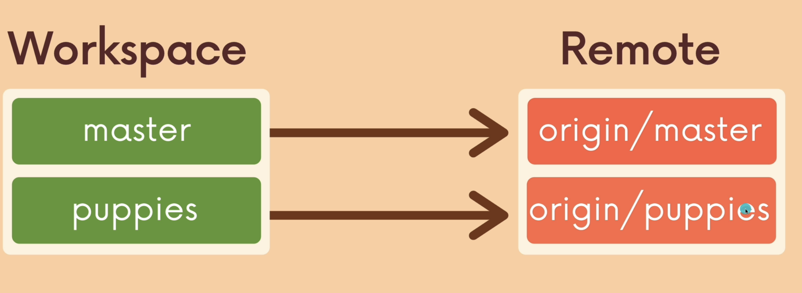

If we would use the branch name that is not visible locally, but exists remote, ex. `puppies` is not visible locally, but we know that `origin/puppies` exists, when we use `git switch puppies` Git will use remote as the reference

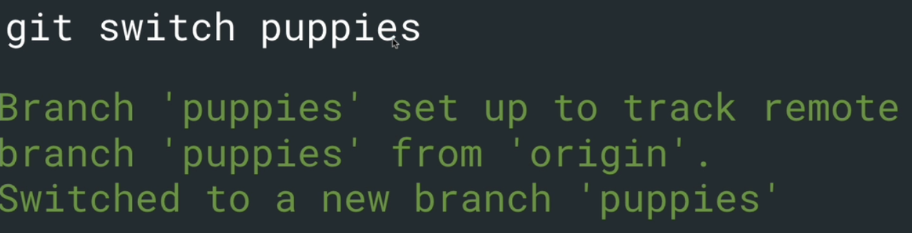

## `git fetch` and `git pull`

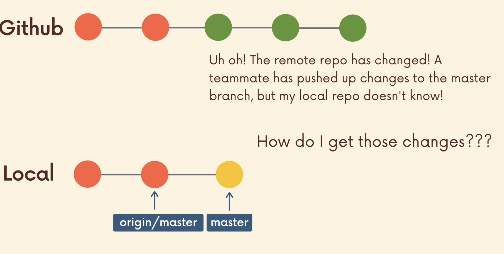

Imagine example when you and your coworkers are working on project. You are starting from the same point ex. `origin/master`. From now your added one commit to your local workspace, so you are ahead 1 commit ahead of `origin/master` on your local `master`. BUT in the same time your coworkers just pushed some repo changes to the Github remote `master` branch.

*What does it mean?*

**It means you won't be able to push your changes as your local repository is behind the Github `origin/master`. Now you have to gain the information about the latest changes pushed to master**

This is where `git fetch` and `git pull` come in.

### `git fetch`

`git fetch` is the way to ONLY get the necessary from remote to local repository. It differs drastically from `git pull` which pulling the changes exactly to local workspace.

`git fetch <remote>`/`git fetch <remote> <branch>` (if remote and branch are not specified it will look for `origin`) fetches the information to the local repository, but does not affect the changes made by you.

 It can be understood as "go into Github, get an information about latest changes and transfer them into local directory WITHOUT affecting my current work"

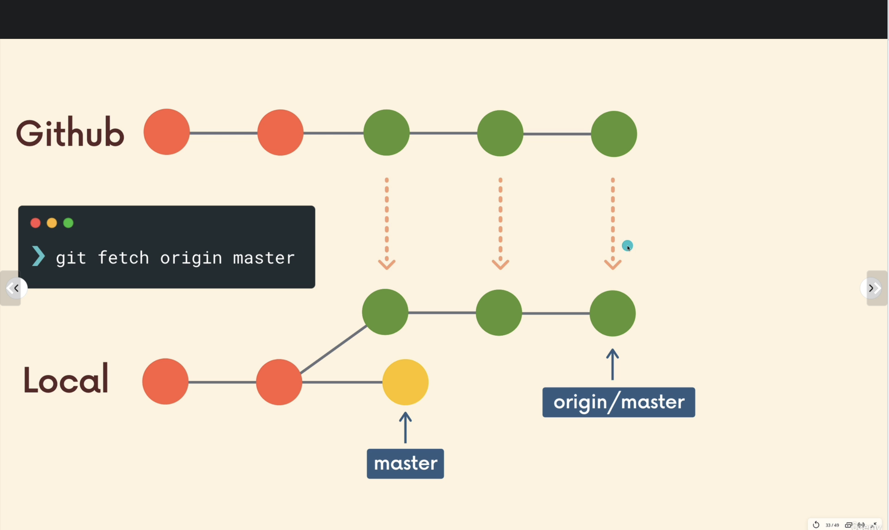

Current work is untouched, we have these changes locally and can even investigate them using `git checkout <remote>/<branch>`. We would be able to integrate our changes to Github remote.

### `git pull`

`git pull <remote> <branch>` otherwise is more powerful command. It pulls the data directly to our workspace and setting up HEAD.

 It can be understood as "go into Github, get an information about latest changes and transfer them into local directory AND incorporate these changes"

We can think like that:

`git pull` = `git fetch` + `git merge`

`git pull` = update information about changes + incorporate them into my repository and branch

***BE CAREFUL***: **`git pull` highly depends where it is invoked. It should be invoked from the branch that we want our changes to be applied into**

This is why `git pull` can be a result of many conflicts while collaborating.

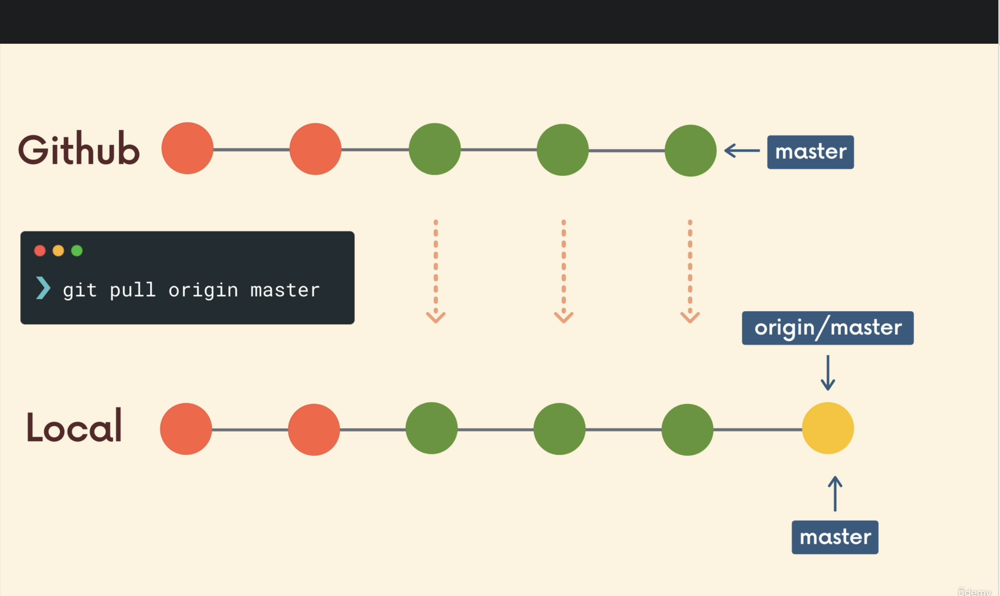

In the best scenario nothing wrong will happen because of clear committing and fast forward merge, but sometimes when pulling the data, working on the same file can result the conflicts that should be resolved manually. **Pull is not recommended when we have uncommitted changes, better use fetch**

## Github Gist

[Github Gist](https://gist.github.com/) is a place when people can place the useful code snippets that are too short to be a separate repository.

example [Setting up AWS user](https://gist.github.com/vicly/de9e12be01b7222b73c6707a7fb27d7e)

## Github Pages

This is a feature hosted by Github, that allows us to host own web pages pushing code to Github.

It works for static pages so it does not support server-side code like Python, Ruby or Node. **Only HTML/CSS/JS**

[Github Pages Intro](https://github.com/skills/github-pages)

Every user has one own domain `username.github.io` and unlimited sites like `username.github.io/repo-name`
