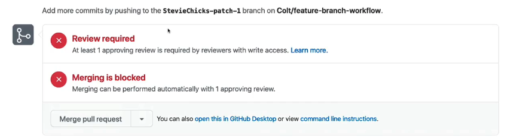
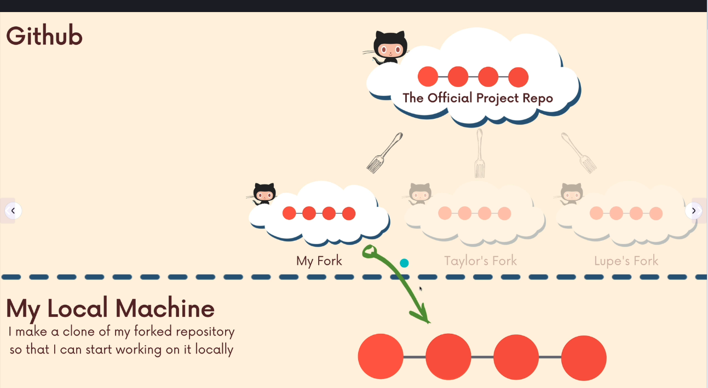

# Collaboration Workflow

## Why not single branch?

Assume we have 3 collaborators:

* Forrest
* Pamela
* David

Everyone is cloning repository `master` branch and start to work.

Forrest is making changes and pushes the code to Github what is perfectly fine

After that Pamela is trying to push her changes. but she faces a problem, because `master` is ahead

She has to pull the changes and merge into her branch

Then she is able to push the changes

Meanwhile David is working on his branch, but suppose he is working on the feature that has a bug. He has a problem with the push too, so needs to reproduce steps that Pamela did. So he pulls from `master`

Now he can push, but the problem is that if he needs to discuss the bug with others he has to push it. That means on the `master` we have the bug, so our app/infra is not working properly, till the bug won't be resolved

To avoid this **Feature branches** have been invented

## Feature branch

According to our example with Forrest, Pamela and David. Workflow with feature branches has been totally different as changes made by each of those developers will be separated into different branches.

David starts `add-dark-theme` branch from master and wants Pamela to review his changes

Pamela is working on her own branch `animated-scroll`, but if needed she can easily switch and pull feature branch `add-dark-theme` to review work from David. **Branches are still separated**

Next day David is coming back to work and he still can work on his branch adding new features. After a changes he pushes code to Github and creates `Pull Request`, after which acceptance, changes are merged to `master`.

## `git merge`

We do not always need to create `Pull Request` to merge branches. We can use `git merge <branch>` command to do it.

***Warning:*** You need to be aware where you are merging. If you want branch `feature` to be merged into `master`, you have to be on `master` and invoke `git merge feature`.

## Pull Request

Pull Requests are native feature for Github, not Git. They allow to review changes by developers before they will be merged into the branch. Pull Request is the last stage before merging changes. In most of the corporate repositories direct `git merge` command to `master/main` is blocked and can be done **only after accepted Pull Request**

## Branch Protection Rules

Branch Protection Rules is the feature that blocks direct merge mentioned above. We can configure branches in Github to increase the security and reduce conflicts cases.

## Forking

Fork & Clone is the popular workflow that is used widely in open-source projects. Image situation where we have a Spark official repository. Fork & Clone give us opportunity to create a personal copy of repository on our own Github and work on it. While copying our repository and contribute to this we are maintaining new versions of features that will be pushed into original repository after pull request accepted by group of maintainers of official repository.

### How to fork?

Let's try to fork official repository of `Apache/Spark`.

1. We are going to the official repository of Apache Spark and click the `fork` button
    

2. We need to name our forked repo
    

3. Our forked repository copy is created
    

4. We can copy it to our local directory and contribute
    

### How does it work under the hood?

Basically many developer's repositories can exists

Every developer has its own forked repository

When repository is forked and cloned `origin` is set to our forked repository and `upstream` is set to official repository

Due to this mechanism our changes can be pushed only via our forked repository and changes can be done only by Pull Request (origin capabilities)

But pull can be done directly from official repository (upstream capabilities)

Overall flow can be found below

