# Rebase

## `git rebase` why so scary?

Most of DEVs are talking about `git rebase` as one of the most terrific changes that can be applied through the Git along with `git push --force origin main`, but regardless from pushing omitting the branch protection, `git rebase` can be very useful as:

- the alternative for merging
- cleaning up the Git history

## Differences between `git merge` and `git rebase`

Usually when we have a `feature` branch and wants to merge the changes to `master` we are doing `git merge` as below

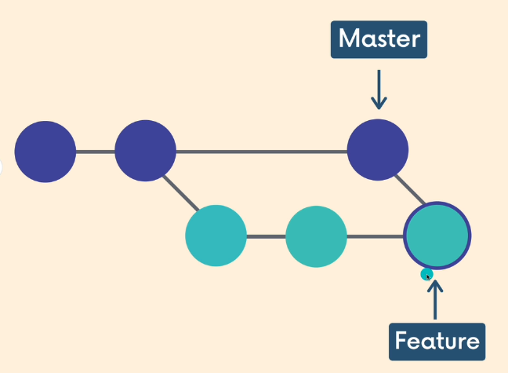

After that merge, the `feature` branch is usually deleted. But sometimes there are the situation when `feature` branch is not deleted and the work have been done on this one like below


That means, the history of changes will be messy. We can use

```bash
git switch feature
git rebase master
```

to move desired changes adn rewrite the history, cleaning it up

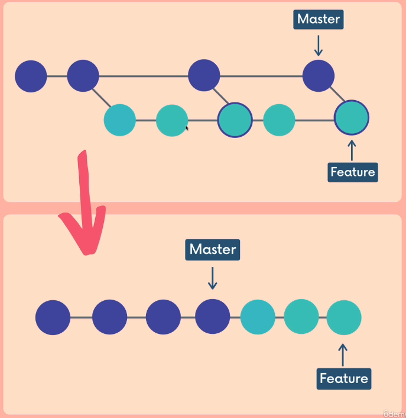

Rebase rewrite history creating new commits for logical `feature` branch commits

## Example

Suppose we want to recreate structure from above section

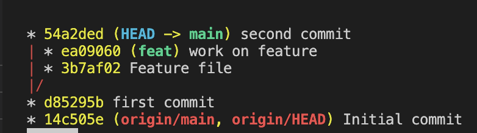

We made another branch `feat` that we will operate on. From now we will merge `main` into `feat` using

```bash
git merge main
```

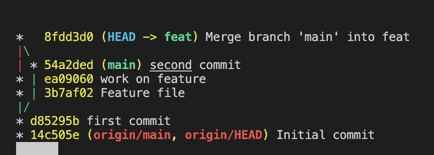

From now we would make some another commits on both branches

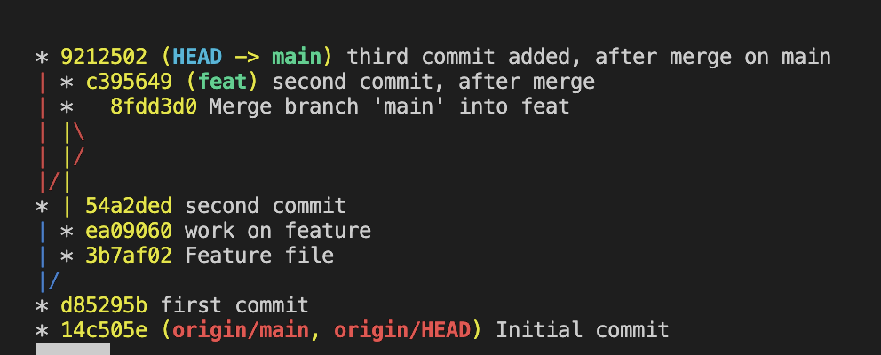

```bash
git merge main
```

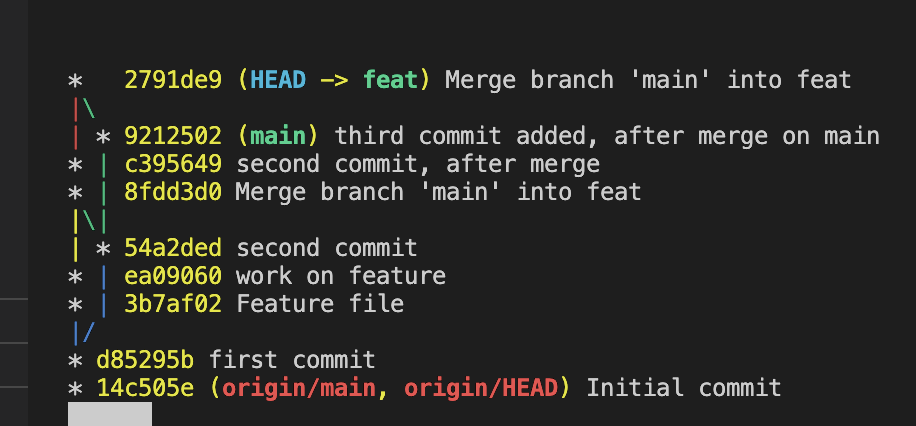

Our history is messed up. We want to fix it using rebase on feat branch

```bash
git rebase main
```

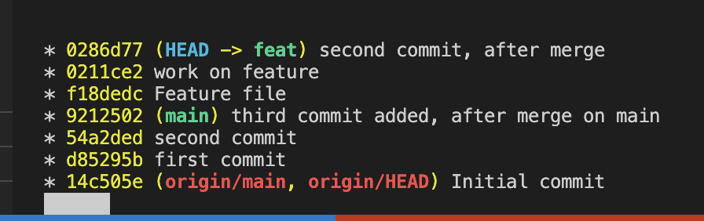

History is cleaned up. Suppose we want to made some other commits to check how it will behave

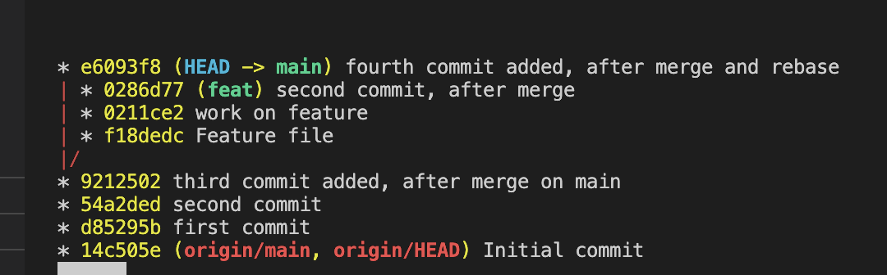

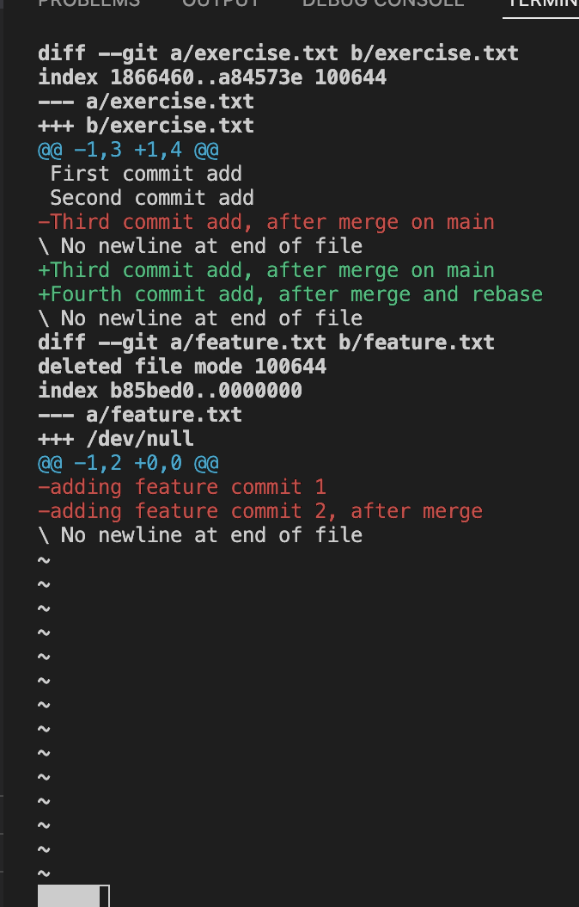

We see visible differences between the branches. While we use rebase once again our history should be cleaned

```bash
git rebase main
```

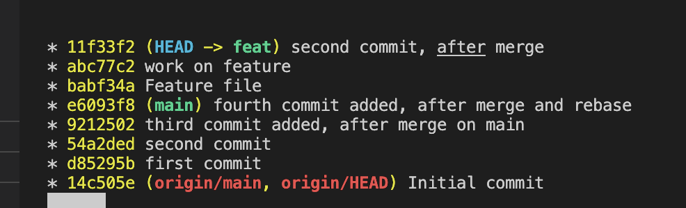

From now we can merge changes on `main` and push them using

```bash
git merge feat
git push origin main 
```


Our history is clean. **It is much easier to clean everything while we didn't push anything to Github. After that is can be much more complicated, thus do not use `git push` until your local history is not clean**

***WARNING!!!:*** Above statement is a "golden rule" for not using rebase. If we are sharing commits with others WE DO NOT REBASE ANYTHING UNLESS WE HAVE ACCEPTANCE FROM OUR TEAMMATES. This is the real danger, as reconcile the history of others is a real pain. This is why developers are aware of using rebase.

We cam end up getting conflicts using `git rebase`. While doing that we need to do the same as the regular conflicts so change them manually. After changes are done we need to:

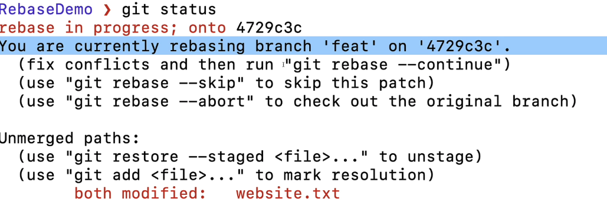

```bash
git add <resolved-filename>
git rebase --continue
```

without `git commit`, as `git rebase --continue` will automatically handle changes
