# Cleaning History

## Interactive rebase

Sometimes there is a need to rewrite, delete or reorder commits. To do this we can use interactive rebase feature.

```bash
git rebase -i HEAD~4
```

Interactive rebase allows us to edit commits, add files, drop commits etc. **We are rebasing a series of commits onto the HEAD they are currently based on, NOT onto another branch like in `git rebase <branch>`**

EXAMPLE: [Cleaning history](./exercise/interactive-rebase-demo/README.md)

After `git rebase -i` we can see two views:

**Classical:**

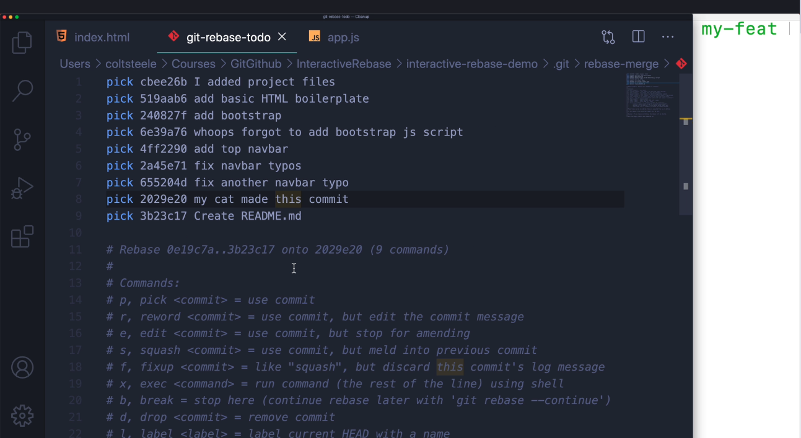

**With installed Git Lens extension in VSCode:**

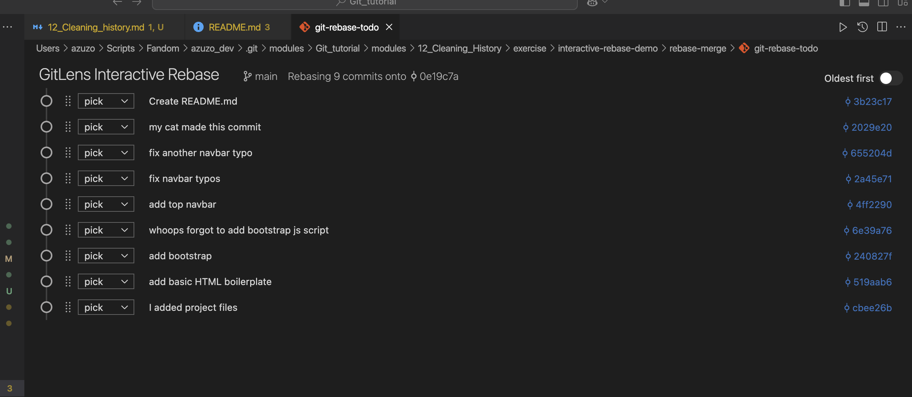

There are few commands that we can pick, the most important ones are:

* ***pick*** - use the commit
* ***reword*** - use commit, edit the commit message
* ***edit*** - use commit, stop here and change it
* ***fixup*** - use commit content, but insert it into the previous commit and discard this commit message
* ***drop*** - remove commit

After selection of given commits and changing options we can change them

### REWORD

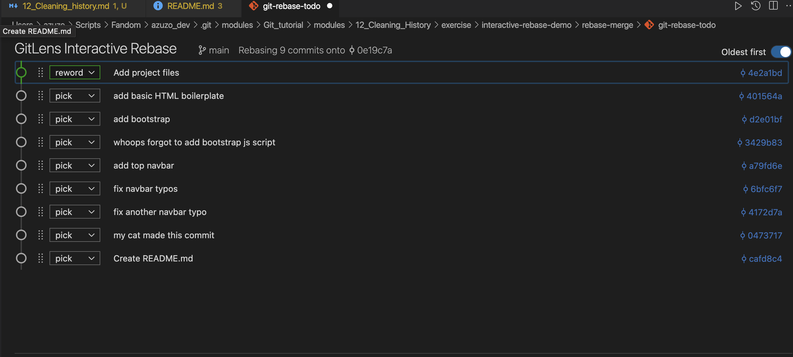

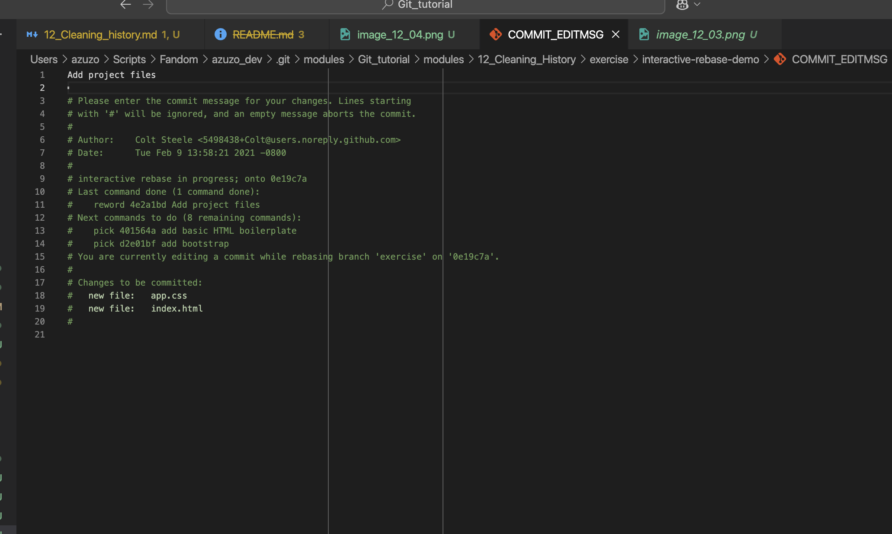

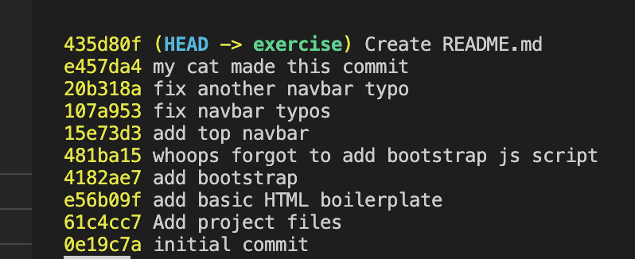

We can meld them using `fixup` on `6e39a76`

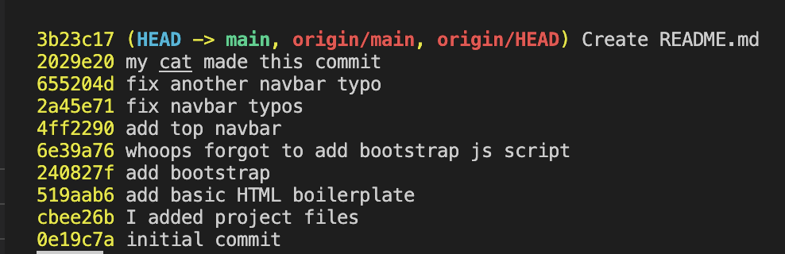

### FIXUP

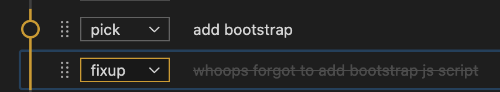

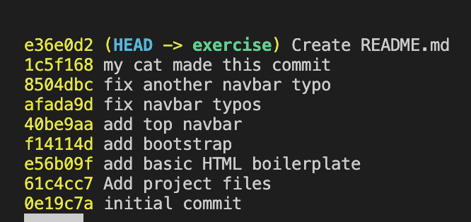

We can even check the differences using:

```bash
git switch main
git checkout <melded-commit-hash>..<retained-commit-hash>
```

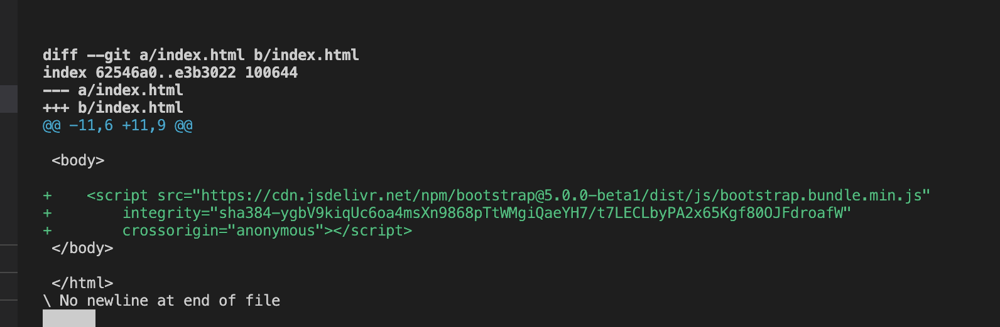

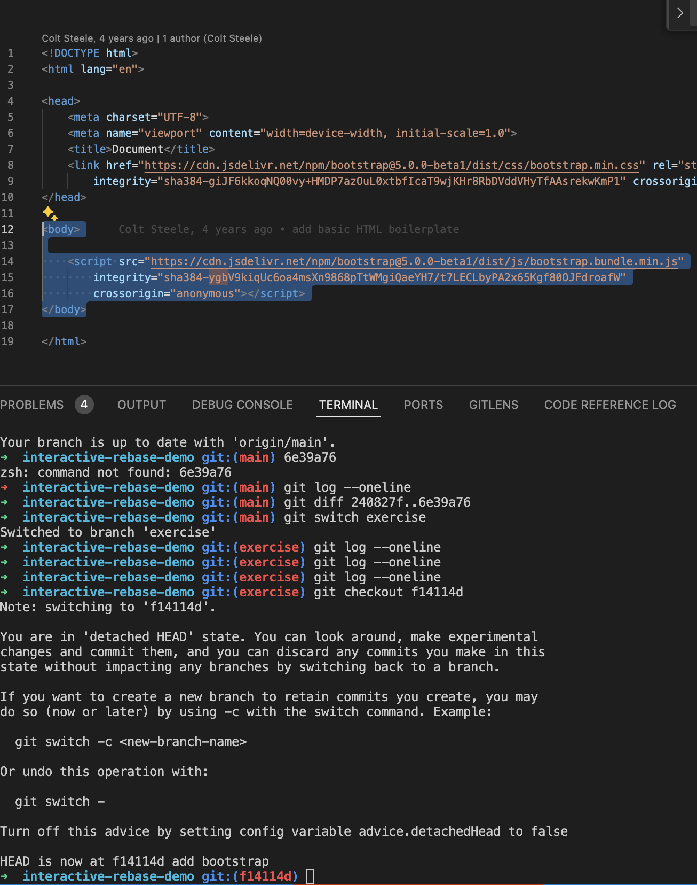

We can do the same with many of commits concurrently

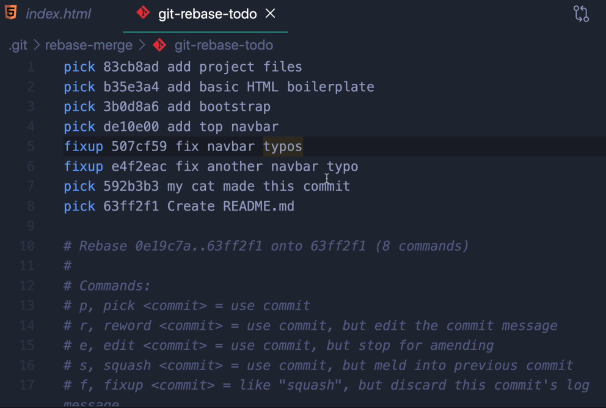

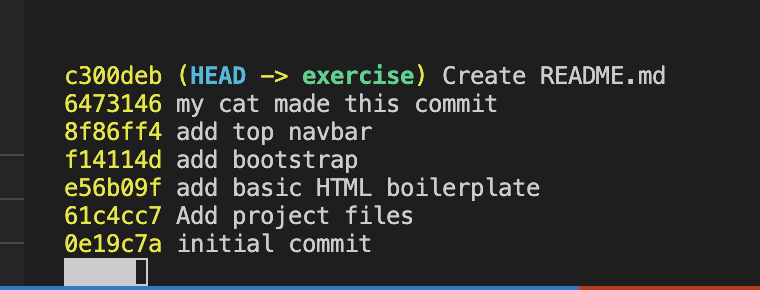

### DROP

We can easily drop commits we do not want to keep

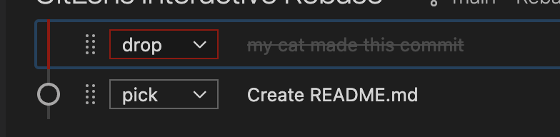

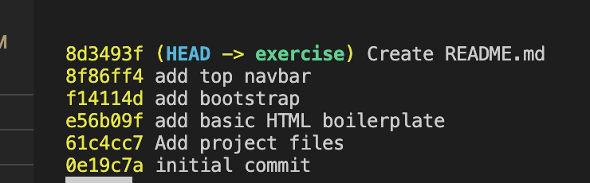

### EDIT OR `git commit --amend`

We can use edit, but alternative for this one is `git commit --amend`

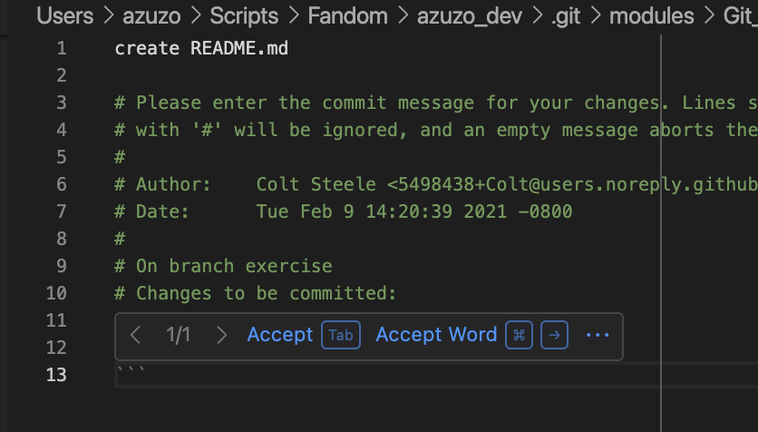

After all the changes we can compare logs on both `main` and `exercise`

**`main`**

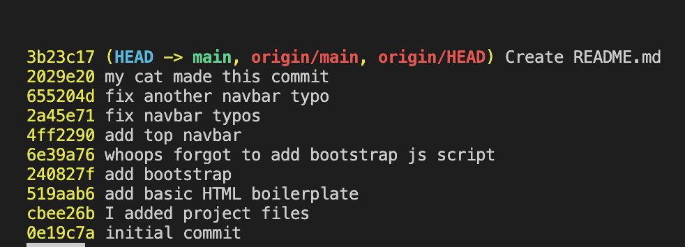

**`exercise`**
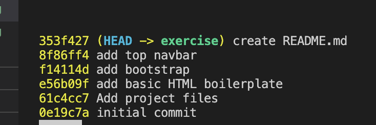
