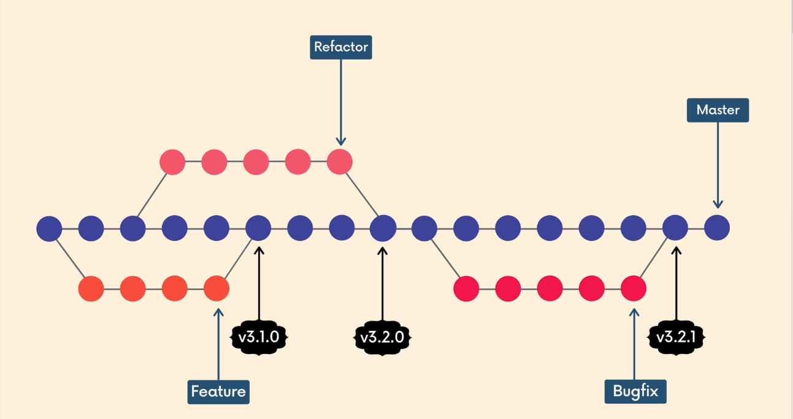
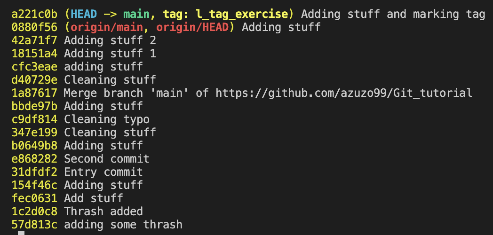
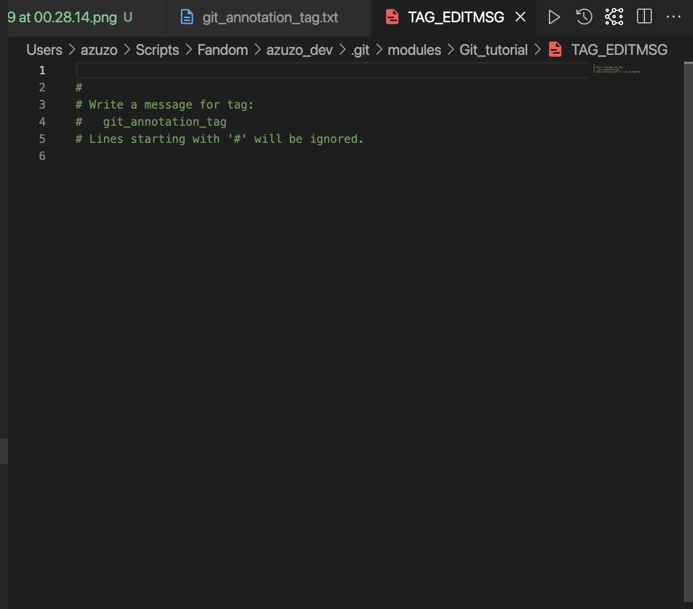
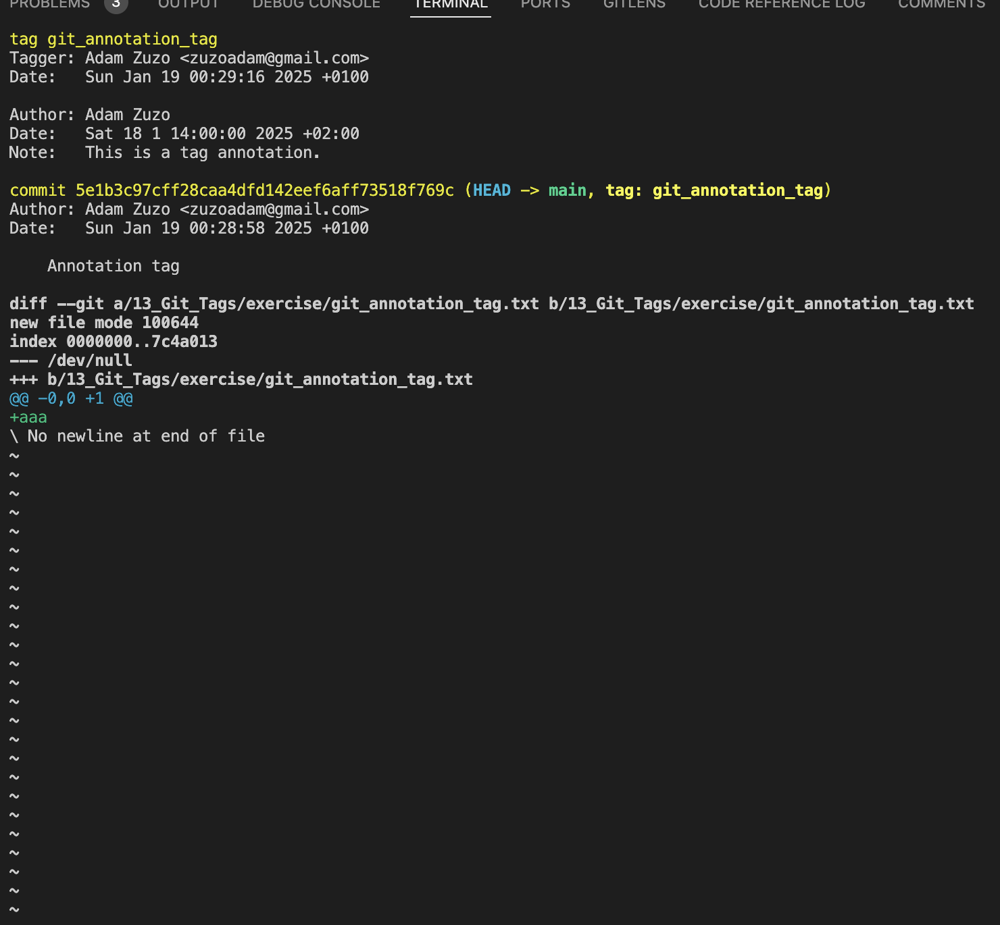
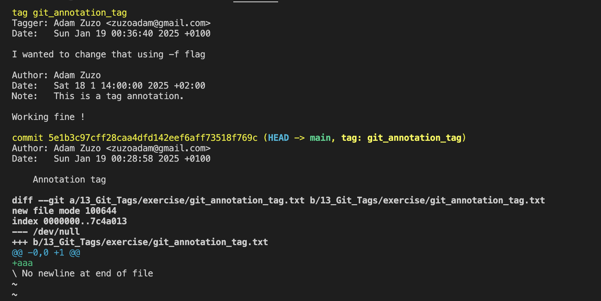

# Git Tags

Git Tags is a useful way to point out important moment in the time in our repositories. For example if we are releasing new version of our project or changing the engines we can mark this changes with tag as a pointer to specific label to commit. Tags do not modify anything.

There are two types of tags in Git:

* **Lightweight**
* **Annotated**

## Lightweight Tags

This is just a name/label that points to particular commit

## Annotated Tags

They are storing extra metadata as:

* author's name
* email
* date
* tagging message

## Releases semantics

There is a standard in semantics over the version names [Semantic Versioning](https://semver.org/)

Example: **2.4.1**

* **2 - major release**, that are crucial, no backward compatible. That changes can break down the existing software.
* **4 - minor release**, that applies new features or functionality, but project is still compatible backwards. This functionalities are optional and if not used, should not break the existing software down
* **1 - patch release**, that do not contain any new features or significant changes. Typically fixes bugs and applying changes that do not impact usage of code

## `git tag`

### Checking

We can use `git tag` to see over the tags made in projects. If we want to filter the tags to the specific ones we can use `git tag -l "<regex>"`.

### Comparing

We can check tags and compare them using `git checkout <tag>` or `git diff <tag-1>..<tag-2>`

### Adding

#### Lightweight Tag

Use `git tag <name>` after `git commit -m <message>` to mark this commit

This is visible in `git log --oneline`

#### Annotation Tag

Use `git tag -a <name>` after `git commit -m <message>` to mark this commit. After that the window will pop up

After inserting information we can close it and our annotation tag will be saved. Using `git show <tag-name>`

We can tag previous commits to using `git tag <tag-name> <commit-hash>`

### Changing

We can change our tags using `git tag <tag-name> <commit> -f`

Example base on my previous tags `git tag -a git_annotation_tag 5e1b3c9 -f` pops up the window and let me make my changes. New tag replacing old one, `git show git_annotation_tag`

### Deleting

We just need to use `git tag -d <tag-name>`

### Pushing

***IMPORTANT:*** normally **tags are not pushed when using `git push`**. If we want all tags to be pushed we need to use `git push --tags`
