# Git Under The Hood

## `.git` file

`.git` file includes necessary stuff that allows the Git system operates behind the scenes


we can navigate there using

```bash
ls -a
cd .git 
```

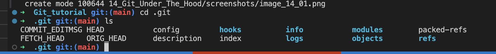

### refs

`refs` directory contains the information about `heads`, `remotes` and `tags`

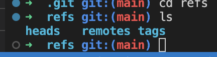

For example in `head` we have information about where the head fo given branch is located

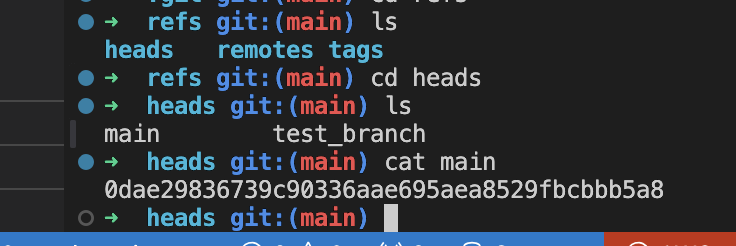

Same for `remotes` and `tags`
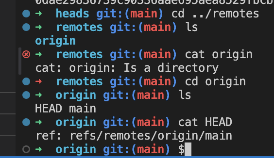
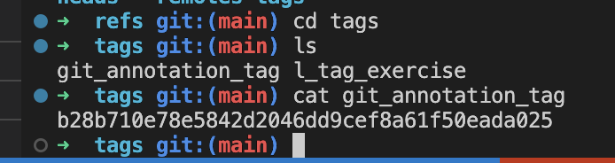

### HEAD

Git HEAD folder contains the hash that refers to the commit that the HEAD is attached to for a current branch

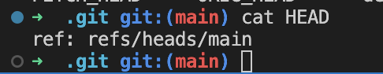

### objects

This folder contains all repo files. This is were backups sit, commits , files and more. Files are always compressed and encrypted.

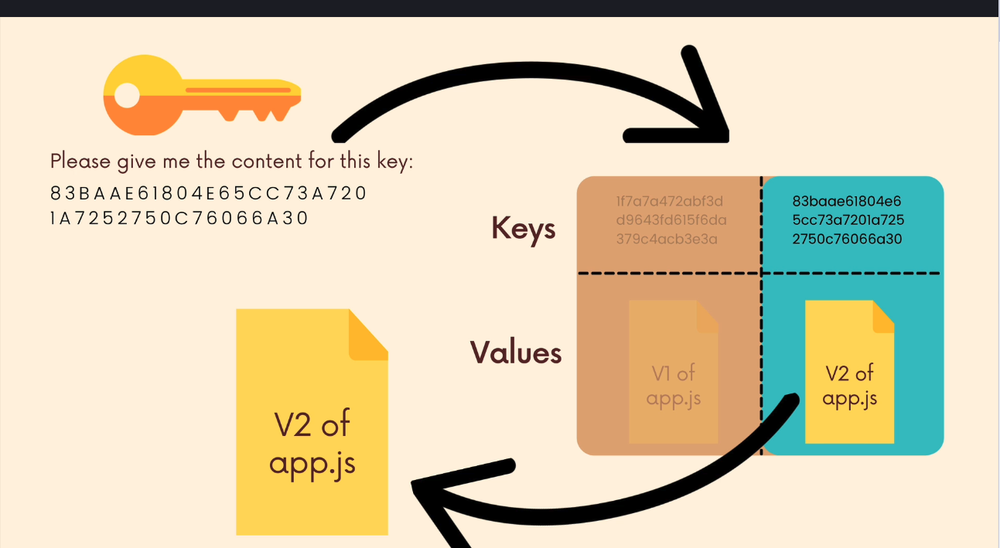

Git is using SHA-1 algorithm to create hashes

There are 4 types of objects in Git:

* BLOBs
* Trees
* Commits
* annotated tags

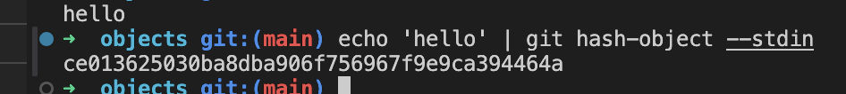

Git is key-value database that keeps organized rows distinguished by unique keys that are used to retrieve objects (hashes).

Objects in Git are organized into the hierarchy where hashes refers to certain parent tree of commit

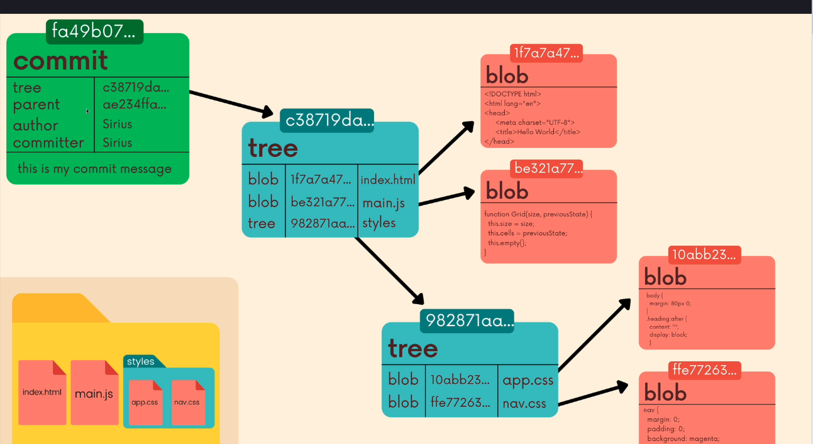

#### BLOBS

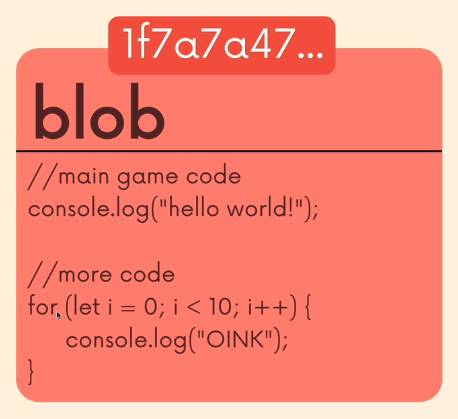

Are the most basic organization units of Git. They keep the content of files. They do not even store names, this is pure content of files distinguished by hash

#### Trees

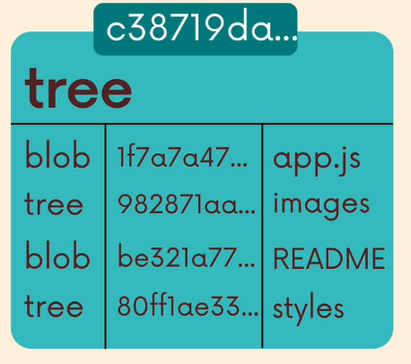

Trees store the contents of the directory. Each tree contain a pointer to another tree of blob and filename

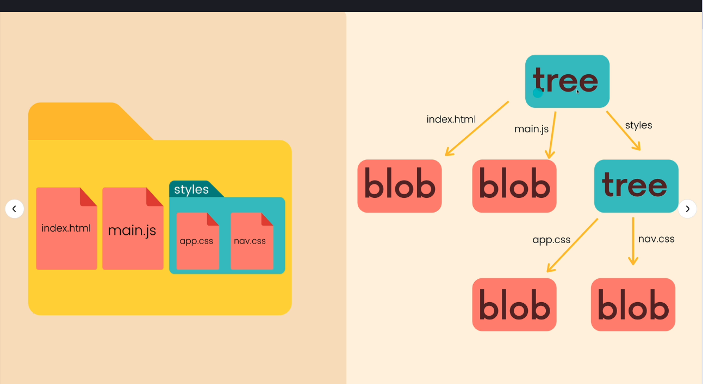

#### Commits

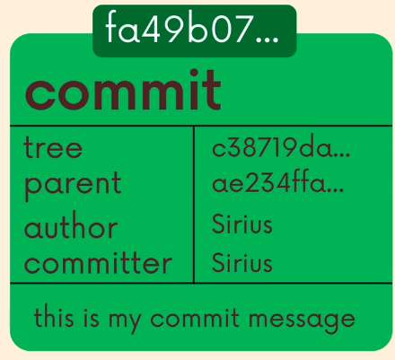

Commits combine tree along the information chain of changes. Commits store reference to the parent commit, author, committer and commit message
