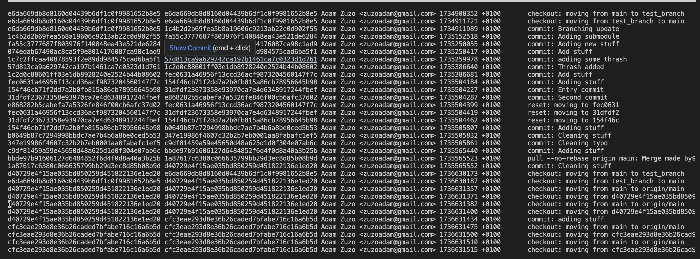
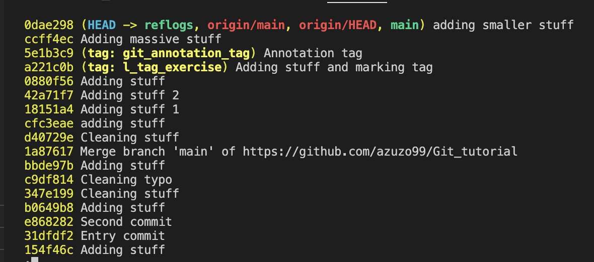
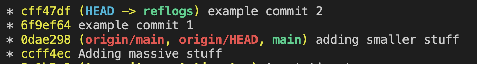
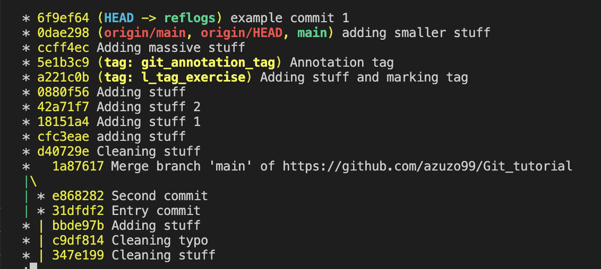
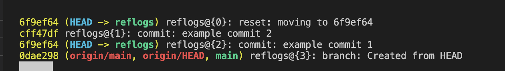
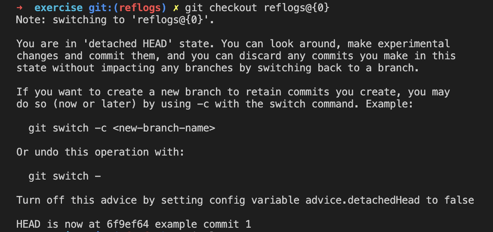
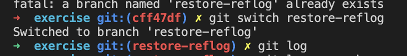
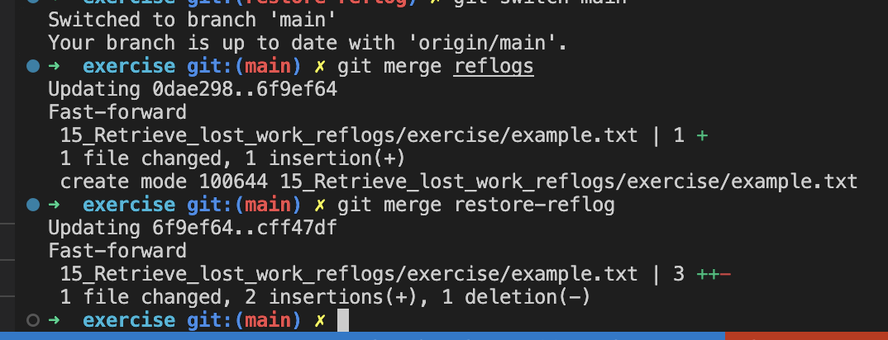
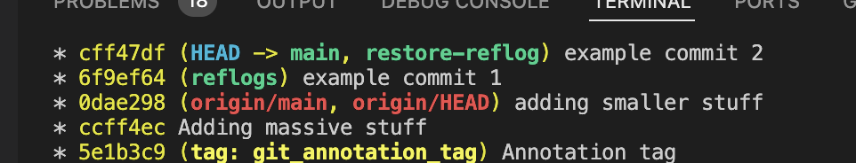

# Reflogs

As it was stated Git is storing the information in key-value database. What is interesting it has information about when part of branches, heads and other references were updated.

We can review and use these logs using `git reflog`

This command points to folder `.git/logs`

```bash
cd .git/logs
nano HEAD
```



***LIMITATIONS:*** **This is a local activity otherwise it would need to track activity of all collaborators and are stored around 90 days, but it can be configured**

## Subcommands

We can use some subcommands:

* `git reflog show`
* `git reflog expire`
* `git reflog delete`
* `git reflog exists`

## Logs vs Reflogs

Reflogs gives opportunity to go back to the point where we screw something up and start from this point. We just need a reference for specific reflog `name@{qualifier}`. Using this we can use reflogs in checkouts,resets or merges.

So we have a diff between logs (`HEAD~2`) and reflogs (`HEAD@{2}`)

## Time based filters

We can even use time qualifiers for reflogs. Example:

`git reflog master@{one.week.ago}`
`git checkout bugfix@{2.days.ago}`
`git diff main@{0} main@{yesterday}`

## Reflog rescue

Reflogs can be helpful to access commits that seem lost and are not in git logs

We can use them to make a separate branch from this point.

Suppose we have a branch `main` and we starting from another branch `reflogs`



We made 2 commits on `reflogs`



Unfortunately somebody has used `git reset --hard 6f9ef64` and we lost commit `cff47df`




But no worries! With `git reflog` we can easily bring back this little boy. We just need a hash or reference



we can now use `git checkout reflogs@{0}` to detach the HEAD



From now we have our lost changes. All we need to do to make another branch `restore-reflog` using

```bash
git switch -c restore-reflog
```



From now our lost changes sits on branch `restore-reflog`

All we have to do now is to merge them into `main`



After checking `git log --oneline --graph` we can see how is it handled by Git and we see our history is up do date.



We can do the same while undoing `git rebase`
