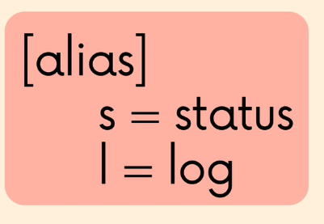
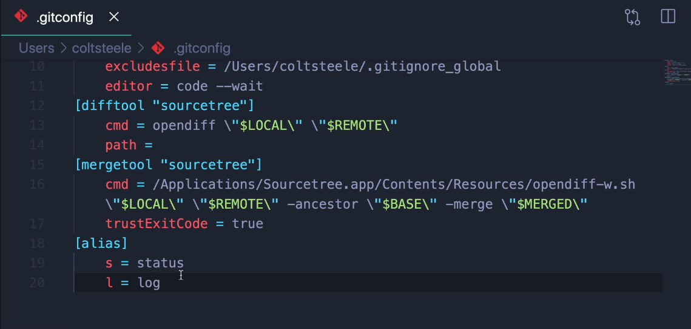

# Git Aliases

Git aliases allow us to write our own alias for git commands adding changes to `.gitconfig` file.





We can set them using CLI too using

```bash
git config --global alias.<alias> <command>
# EXAMPLE: git config --global alias.show_branches branch
```

There are a lot of created aliases on:

* [Github/gitalias](https://github.com/GitAlias/gitalias)
* [Must-Have Blog](https://www.durdn.com/blog/2012/11/22/must-have-git-aliases-advanced-examples/)
* [GithubGist](https://gist.github.com/mwhite/6887990)
